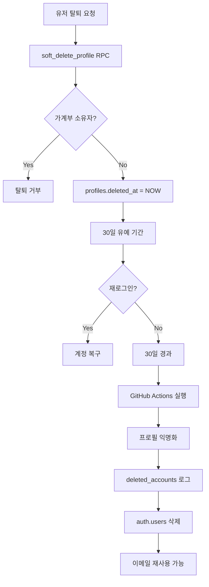

# 회원 탈퇴 구현 계획

## 📋 개요

Bugie 서비스의 회원 탈퇴 프로세스는 사용자의 개인정보를 보호하면서도 데이터 무결성을 유지하는 균형잡힌 접근을 목표로 합니다.

### 핵심 정책

1. **Soft Delete + 30일 유예 기간**
   - 탈퇴 요청 시 즉시 삭제가 아닌 soft delete 처리
   - 30일 이내 재로그인 시 계정 복구 가능
   - 30일 경과 후 자동으로 익명화 처리

2. **익명화 후 Auth 삭제**
   - profiles 테이블은 익명화만 진행 (데이터 보존)
   - auth.users는 완전 삭제 (이메일 재사용 가능)
   - 거래 기록은 보존되며 "탈퇴한 사용자"로 표시

3. **재가입 정책**
   - 동일 이메일로 재가입 가능 (30일 후)
   - 재가입 시 새로운 UUID 발급
   - 이전 데이터와 연결되지 않음

## 🏗️ 아키텍처

### 전체 프로세스 플로우



### 데이터 흐름

| 단계      | profiles            | auth.users | transactions.created_by |
| --------- | ------------------- | ---------- | ----------------------- |
| 탈퇴 요청 | deleted_at 설정     | 유지       | 유효한 참조             |
| 30일 후   | 익명화 (email/name) | 삭제       | 익명 프로필 참조        |
| UI 표시   | "탈퇴한 사용자"     | -          | 정상 작동               |

## ⚠️ 중요 사항: CASCADE 문제

### 현재 스키마의 치명적 문제

```sql
-- 현재 구조 (문제!)
CREATE TABLE profiles (
  id uuid REFERENCES auth.users ON DELETE CASCADE PRIMARY KEY,
  -- CASCADE: auth.users 삭제 시 profiles도 함께 삭제됨!
)
```

### 필수 수정사항

```sql
-- CASCADE 제거 필수!
ALTER TABLE profiles
  DROP CONSTRAINT profiles_id_fkey;

ALTER TABLE profiles
  ADD CONSTRAINT profiles_id_fkey
    FOREIGN KEY (id)
    REFERENCES auth.users(id)
    ON DELETE NO ACTION; -- CASCADE 제거
```

**CASCADE를 제거하지 않으면:**

1. auth.users 삭제 시 profiles도 삭제됨
2. 익명화된 데이터 손실
3. transactions.created_by가 무효한 참조가 됨

## 📝 구현 상세

### Step 1: 데이터베이스 준비

#### 1-1. CASCADE 제거 (최우선!)

```sql
-- supabase/migrations/20250827_01_remove_cascade.sql

BEGIN;

-- CASCADE 제거
ALTER TABLE profiles
  DROP CONSTRAINT profiles_id_fkey;

ALTER TABLE profiles
  ADD CONSTRAINT profiles_id_fkey
    FOREIGN KEY (id)
    REFERENCES auth.users(id)
    ON DELETE NO ACTION;

-- 검증
DO $$
BEGIN
  IF EXISTS (
    SELECT 1 FROM information_schema.referential_constraints
    WHERE constraint_name = 'profiles_id_fkey'
    AND delete_rule = 'CASCADE'
  ) THEN
    RAISE EXCEPTION 'CASCADE still exists!';
  END IF;
END $$;

COMMIT;
```

#### 1-2. 추적 테이블 생성

```sql
-- supabase/migrations/20250827_02_create_tracking_tables.sql

BEGIN;

-- 삭제 계정 추적 (개인정보 최소화)
CREATE TABLE IF NOT EXISTS deleted_accounts (
  id UUID DEFAULT gen_random_uuid() PRIMARY KEY,
  original_user_id UUID NOT NULL,
  email_hash TEXT NOT NULL, -- SHA256 해시로 저장
  deleted_at TIMESTAMPTZ NOT NULL,
  anonymized_at TIMESTAMPTZ,
  auth_deleted_at TIMESTAMPTZ,

  CONSTRAINT unique_original_user UNIQUE(original_user_id)
);

CREATE INDEX idx_deleted_email_hash ON deleted_accounts(email_hash);

-- 작업 로그
CREATE TABLE IF NOT EXISTS deletion_job_logs (
  id UUID DEFAULT gen_random_uuid() PRIMARY KEY,
  executed_at TIMESTAMPTZ DEFAULT NOW(),
  anonymized_count INTEGER DEFAULT 0,
  deleted_auth_count INTEGER DEFAULT 0,
  error_count INTEGER DEFAULT 0,
  created_by TEXT DEFAULT 'github-actions'
);

COMMIT;
```

### Step 2: RPC 함수 생성

```sql
-- supabase/migrations/20250827_03_create_deletion_function.sql

CREATE OR REPLACE FUNCTION process_account_deletions()
RETURNS json
LANGUAGE plpgsql
SECURITY DEFINER
AS $$
DECLARE
  v_result RECORD;
  v_anonymized_count INTEGER := 0;
  v_profiles_to_delete JSONB := '[]'::JSONB;
  v_anonymous_id TEXT;
BEGIN
  -- 30일 경과한 계정 처리 (배치 50개)
  FOR v_result IN
    SELECT id, email, deleted_at
    FROM profiles
    WHERE deleted_at IS NOT NULL
      AND deleted_at <= NOW() - INTERVAL '30 days'
      AND email NOT LIKE 'deleted-%'
    ORDER BY deleted_at ASC
    LIMIT 50  -- Rate limit 고려
  LOOP
    -- 익명 ID 생성
    v_anonymous_id := SUBSTR(MD5(v_result.id::text), 1, 8);

    -- 1. 해시로 저장 (개인정보 보호)
    INSERT INTO deleted_accounts (
      original_user_id,
      email_hash,
      deleted_at,
      anonymized_at
    ) VALUES (
      v_result.id,
      encode(sha256(v_result.email::bytea), 'hex'),
      v_result.deleted_at,
      NOW()
    ) ON CONFLICT (original_user_id) DO NOTHING;

    -- 2. 프로필 익명화
    UPDATE profiles SET
      email = 'deleted-' || v_anonymous_id || '@anon.local',
      full_name = '탈퇴한 사용자',
      avatar_url = NULL,
      updated_at = NOW()
    WHERE id = v_result.id;

    -- 3. Auth 삭제 대상 목록
    v_profiles_to_delete := v_profiles_to_delete ||
      jsonb_build_object('user_id', v_result.id);

    v_anonymized_count := v_anonymized_count + 1;
  END LOOP;

  RETURN json_build_object(
    'success', true,
    'count', v_anonymized_count,
    'users', v_profiles_to_delete
  );
EXCEPTION
  WHEN OTHERS THEN
    RETURN json_build_object(
      'success', false,
      'error', SQLERRM
    );
END;
$$;

-- 권한 설정
GRANT EXECUTE ON FUNCTION process_account_deletions() TO service_role;
GRANT EXECUTE ON FUNCTION process_account_deletions() TO postgres;
```

### Step 3: GitHub Actions 워크플로우

```yaml
# .github/workflows/process-account-deletions.yml

name: Process Account Deletions

on:
  schedule:
    # 매일 한국시간 새벽 3시 (UTC 18:00)
    - cron: '0 18 * * *'

  workflow_dispatch:
    inputs:
      dry_run:
        description: 'Dry run mode'
        type: boolean
        default: false

jobs:
  process-deletions:
    runs-on: ubuntu-latest

    steps:
      - name: Checkout
        uses: actions/checkout@v4

      - name: Setup Node.js
        uses: actions/setup-node@v4
        with:
          node-version: '20'

      - name: Install dependencies
        run: npm install @supabase/supabase-js

      - name: Process deletions
        env:
          SUPABASE_URL: ${{ secrets.SUPABASE_URL }}
          SUPABASE_SERVICE_KEY: ${{ secrets.SUPABASE_SERVICE_KEY }}
          DRY_RUN: ${{ inputs.dry_run || 'false' }}
        run: |
          node scripts/process-deletions.js
```

### Step 4: 처리 스크립트

```javascript
// scripts/process-deletions.js

const { createClient } = require('@supabase/supabase-js');

const supabase = createClient(
  process.env.SUPABASE_URL,
  process.env.SUPABASE_SERVICE_KEY,
  { auth: { persistSession: false } }
);

async function processAccountDeletions() {
  const isDryRun = process.env.DRY_RUN === 'true';
  console.log(`Starting (Dry run: ${isDryRun})`);

  try {
    // 1. 익명화 처리
    const { data: result, error } = await supabase.rpc(
      'process_account_deletions'
    );

    if (error) throw error;

    console.log(`Anonymized: ${result.count} profiles`);

    // 2. Auth 삭제
    let deletedCount = 0;
    const errors = [];

    for (const user of result.users || []) {
      if (isDryRun) {
        console.log(`[DRY] Would delete: ${user.user_id}`);
        continue;
      }

      try {
        await supabase.auth.admin.deleteUser(user.user_id);

        await supabase
          .from('deleted_accounts')
          .update({ auth_deleted_at: new Date().toISOString() })
          .eq('original_user_id', user.user_id);

        deletedCount++;
      } catch (err) {
        errors.push({ user_id: user.user_id, error: err.message });
      }
    }

    // 3. 로그 저장
    if (!isDryRun) {
      await supabase.from('deletion_job_logs').insert({
        anonymized_count: result.count,
        deleted_auth_count: deletedCount,
        error_count: errors.length,
      });
    }

    console.log(`Completed: ${deletedCount} auth deleted`);
    if (errors.length > 0) process.exit(1);
  } catch (error) {
    console.error('Fatal error:', error);
    process.exit(1);
  }
}

processAccountDeletions();
```

## 🔐 보안 고려사항

### 개인정보 보호

- **이메일 해시 저장**: 원본 이메일 대신 SHA256 해시만 저장
- **최소 정보 원칙**: full_name 등 불필요한 개인정보 저장 안함
- **익명화**: 식별 불가능한 형태로 변환

### 권한 관리

```sql
-- RPC 함수는 service_role만 실행 가능
GRANT EXECUTE ON FUNCTION process_account_deletions() TO service_role;

-- GitHub Actions는 service key 사용
SUPABASE_SERVICE_KEY=${{ secrets.SUPABASE_SERVICE_KEY }}
```

### Rate Limiting

- 배치 크기 50개로 제한
- API 호출 간 지연 고려
- 실패 시 재시도 로직

## 🧪 테스트 시나리오

### 개발 환경 테스트

```sql
-- 테스트 데이터 생성
INSERT INTO profiles (id, email, full_name, deleted_at)
VALUES (
  gen_random_uuid(),
  'test@example.com',
  'Test User',
  NOW() - INTERVAL '31 days'
);

-- RPC 함수 테스트
SELECT process_account_deletions();

-- 결과 확인
SELECT * FROM profiles WHERE email LIKE 'deleted-%';
SELECT * FROM deleted_accounts;
```

### Dry Run 모드

```bash
# GitHub Actions 수동 실행
# Actions 탭 > Run workflow > Dry run 체크
```

## ✅ 구현 체크리스트

### 데이터베이스

- [ ] CASCADE 제거 마이그레이션
- [ ] 추적 테이블 생성
- [ ] RPC 함수 생성
- [ ] 권한 설정 확인

### GitHub Actions

- [ ] 워크플로우 파일 추가
- [ ] Secrets 설정 (SUPABASE_URL, SUPABASE_SERVICE_KEY)
- [ ] 처리 스크립트 작성
- [ ] Dry run 테스트

### 검증

- [ ] CASCADE 제거 확인
- [ ] 익명화 프로세스 테스트
- [ ] Auth 삭제 테스트
- [ ] 재가입 시나리오 테스트

## 📌 주의사항

1. **CASCADE 제거는 필수**: 제거하지 않으면 전체 시스템 실패
2. **개인정보 최소화**: 필요한 정보만 해시로 저장
3. **배치 크기 조절**: API rate limit 고려
4. **모니터링**: 실행 로그 정기 확인

## 🔄 향후 개선사항

- Phase 2: 탈퇴 D-7 알림 메일
- Phase 3: 데이터 아카이빙 시스템
- Phase 4: 완전 삭제 (1년 후)

---

마지막 업데이트: 2025-08-27
