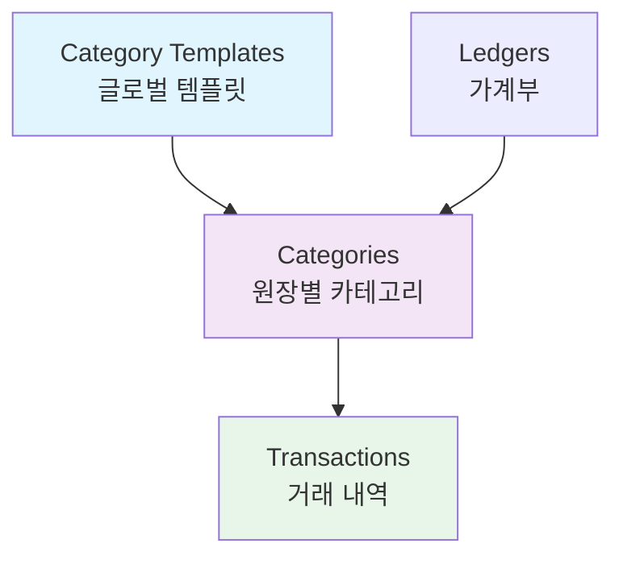
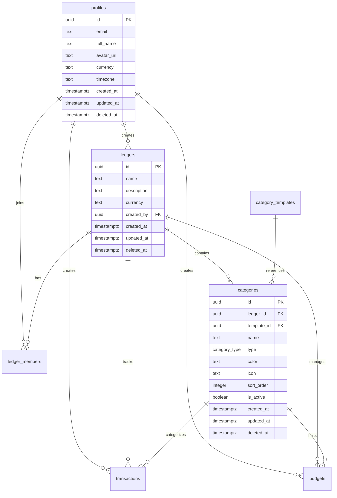

# Bugie 데이터베이스 스키마 설계

> **Bugie**는 공유 가계부 앱으로, 하이브리드 카테고리 시스템과 다중 사용자 지원을 통해 효율적인 재무 관리를 제공합니다.

## 📚 목차

- [📋 프로젝트 개요](#-프로젝트-개요)
- [🏗️ 핵심 아키텍처](#️-핵심-아키텍처)
- [📊 ERD 다이어그램](#-erd-다이어그램)
- [🗂️ 데이터 타입](#️-데이터-타입)
- [📋 테이블 스키마](#-테이블-스키마)
  - [사용자 및 인증](#사용자-및-인증)
  - [가계부 및 멤버십](#가계부-및-멤버십)
  - [카테고리 시스템](#카테고리-시스템)
  - [거래 및 예산](#거래-및-예산)
- [🔍 뷰 및 함수](#-뷰-및-함수)
- [🛠️ 개발 가이드](#️-개발-가이드)

---

## 📋 프로젝트 개요

### 주요 특징

- **다중 사용자 공유**: 하나의 가계부를 여러 사용자가 동시에 사용
- **하이브리드 카테고리**: 글로벌 템플릿 + 사용자 커스텀 카테고리
- **실시간 동기화**: Supabase Realtime을 통한 즉시 반영
- **권한 관리**: 소유자/관리자/멤버/조회자 역할 구분
- **Soft Delete**: 데이터 복구 가능한 안전한 삭제

### 기술 스택

- **Database**: PostgreSQL (Supabase)
- **Authentication**: Supabase Auth
- **Real-time**: Supabase Realtime
- **Security**: Row Level Security (RLS)

---

## 🏗️ 핵심 아키텍처

### 하이브리드 카테고리 시스템

Bugie의 핵심 혁신은 **하이브리드 카테고리 시스템**입니다:



#### 📂 템플릿 기반 카테고리

- `category_templates`: 시스템 전체에서 공유하는 표준 카테고리
- 식비, 교통비, 급여 등 일반적인 카테고리들
- 중복 데이터 제거 및 일관성 보장

#### 🎨 커스텀 카테고리

- 사용자가 원장별로 추가하는 개인화된 카테고리
- 반려동물, 취미 등 개인적인 지출 분류
- 템플릿과 동일한 인터페이스로 통합 관리

#### 💾 저장 공간 효율성

- 기본 카테고리: 템플릿 ID만 참조 저장 (4 bytes)
- 커스텀 카테고리: 실제 데이터 저장 (수십 bytes)
- **75% 이상 저장공간 절약**

---

## 📊 ERD 다이어그램



---

## 🗂️ 데이터 타입

### 열거형 (ENUM) 타입

```sql
-- 멤버 권한
CREATE TYPE member_role AS ENUM ('owner', 'admin', 'member', 'viewer');

-- 카테고리/거래 타입
CREATE TYPE category_type AS ENUM ('income', 'expense');

-- 예산 기간
CREATE TYPE budget_period AS ENUM ('monthly', 'yearly');
```

---

## 📋 테이블 스키마

### 사용자 및 인증

#### 1. 사용자 프로필 테이블 (`profiles`)

> **목적**: Supabase Auth와 연동된 사용자 프로필 및 설정 정보 관리  
> **주요 기능**: 개인 설정, 지역화, 사용자 메타데이터 저장

**핵심 필드**

- `id`: Supabase Auth 사용자 ID와 1:1 매핑
- `currency`: 사용자 기본 통화 (기본값: KRW)
- `timezone`: 사용자 시간대 (기본값: Asia/Seoul)
- `deleted_at`: Soft Delete로 계정 복구 가능

```sql
create table profiles (
  id uuid references auth.users on delete cascade primary key,
  email text,
  full_name text,
  avatar_url text,
  currency text default 'KRW',
  timezone text default 'Asia/Seoul',
  created_at timestamptz default now(),
  updated_at timestamptz default now(),
  deleted_at timestamptz -- Soft Delete
);

-- RLS 정책
alter table profiles enable row level security;
create policy "profiles_policy" on profiles
for all using (auth.uid() = id and deleted_at is null);
```

### 가계부 및 멤버십

#### 2. 가계부 원장 테이블 (`ledgers`)

> **목적**: 공유 가계부의 기본 정보 및 설정 관리  
> **주요 기능**: 다중 사용자 접근, 통화별 관리, 권한 기반 접근 제어

**핵심 필드**

- `name`: 가계부 이름 (예: "우리집 가계부", "부부 공동 가계부")
- `currency`: 가계부별 기본 통화 (사용자별 통화와 독립적)
- `created_by`: 가계부 생성자 (자동으로 'owner' 권한 부여)

**RLS 보안**: 멤버로 등록된 사용자만 접근 가능

```sql
create table ledgers (
  id uuid default gen_random_uuid() primary key,
  name text not null,
  description text,
  currency text default 'KRW',
  created_by uuid references profiles(id) not null,
  created_at timestamptz default now(),
  updated_at timestamptz default now(),
  deleted_at timestamptz -- Soft Delete
);

-- 인덱스
create index idx_ledgers_created_by on ledgers(created_by) where deleted_at is null;

-- RLS 정책
alter table ledgers enable row level security;

-- SELECT 정책: 가계부 조회
create policy "ledgers_select_policy" on ledgers
for select using (
  deleted_at is null and (
    -- 생성자는 항상 조회 가능
    created_by = auth.uid()
    or
    -- 멤버인 경우 조회 가능
    id in (
      select ledger_id 
      from ledger_members 
      where user_id = auth.uid() 
      and deleted_at is null
    )
  )
);

-- INSERT 정책: 가계부 생성
create policy "ledgers_insert_policy" on ledgers
for insert with check (
  -- 누구나 가계부를 생성할 수 있음 (생성자가 owner가 됨)
  created_by = auth.uid()
);

-- UPDATE 정책: 가계부 정보 수정
create policy "ledgers_update_policy" on ledgers
for update using (
  deleted_at is null and (
    -- 생성자
    created_by = auth.uid()
    or
    -- admin 권한자
    id in (
      select ledger_id 
      from ledger_members 
      where user_id = auth.uid() 
      and role in ('owner', 'admin')
      and deleted_at is null
    )
  )
);

-- DELETE 정책: 가계부 삭제 (soft delete)
create policy "ledgers_delete_policy" on ledgers
for delete using (
  -- 생성자만 삭제 가능
  created_by = auth.uid()
);
```

#### 3. 원장 멤버 테이블 (`ledger_members`)

> **목적**: 가계부별 사용자 권한 및 멤버십 관리  
> **주요 기능**: 역할 기반 접근 제어, 초대 시스템, 멤버 관리

**권한 체계**

- `owner`: 모든 권한 (가계부 삭제, 멤버 관리, 모든 데이터 수정)
- `admin`: 관리 권한 (멤버 초대/삭제, 설정 변경, 모든 데이터 수정)
- `member`: 편집 권한 (거래 입력/수정, 예산 설정)
- `viewer`: 조회 권한 (데이터 열람만 가능)

**핵심 필드**

- `unique(ledger_id, user_id)`: 사용자당 가계부별 하나의 멤버십만 허용
- `joined_at`: 멤버 참여 시점 추적
- `deleted_at`: 멤버 탈퇴 시 Soft Delete (재초대 가능)

```sql
create type member_role as enum ('owner', 'admin', 'member', 'viewer');

create table ledger_members (
  id uuid default gen_random_uuid() primary key,
  ledger_id uuid references ledgers(id) on delete cascade not null,
  user_id uuid references profiles(id) on delete cascade not null,
  role member_role default 'member',
  joined_at timestamptz default now(),
  deleted_at timestamptz, -- Soft Delete

  unique(ledger_id, user_id)
);

-- 인덱스
create index idx_ledger_members_user on ledger_members(user_id) where deleted_at is null;
create index idx_ledger_members_ledger on ledger_members(ledger_id) where deleted_at is null;

-- RLS 정책
alter table ledger_members enable row level security;

-- SELECT 정책: 멤버 정보 조회 (보안은 ledgers 테이블에서 처리)
create policy "ledger_members_select_policy" on ledger_members
for select using (
  deleted_at is null
  -- 모든 인증된 사용자에게 개방
  -- 무한 재귀 방지를 위해 의도적으로 개방
  -- 실제 보안은 ledgers 테이블 레벨에서 처리
);

-- INSERT 정책: 멤버 추가 (owner만 - 재귀 방지)
create policy "ledger_members_insert_policy" on ledger_members
for insert with check (
  ledger_id in (
    select id from ledgers 
    where created_by = auth.uid() 
    and deleted_at is null
  )
);

-- UPDATE 정책: 멤버 정보 수정 (owner만 - 재귀 방지)
create policy "ledger_members_update_policy" on ledger_members
for update using (
  deleted_at is null and
  ledger_id in (
    select id from ledgers 
    where created_by = auth.uid() 
    and deleted_at is null
  )
);

-- DELETE 정책: 멤버 삭제
create policy "ledger_members_delete_policy" on ledger_members
for delete using (
  deleted_at is null and (
    -- 자신의 멤버십 삭제 (탈퇴)
    user_id = auth.uid() or
    -- 가계부 생성자는 모든 멤버 삭제 가능
    ledger_id in (
      select id from ledgers 
      where created_by = auth.uid() 
      and deleted_at is null
    )
  )
);
```

### 카테고리 시스템

#### 4. 글로벌 카테고리 템플릿 테이블 (`category_templates`)

```sql
create type category_type as enum ('income', 'expense');

create table category_templates (
  id uuid default gen_random_uuid() primary key,
  name text not null,
  type category_type not null,
  color text default '#3B82F6',
  icon text default 'receipt',
  sort_order integer default 0,
  created_at timestamptz default now(),
  updated_at timestamptz default now(),

  unique(name, type)
);

-- 인덱스
create index idx_category_templates_type_sort on category_templates(type, sort_order);
create index idx_category_templates_name on category_templates(name);

-- RLS 정책 (모든 사용자가 읽기 가능, 관리자만 수정)
alter table category_templates enable row level security;

create policy "category_templates_select_policy" on category_templates
for select using (true);

create policy "category_templates_modify_policy" on category_templates
for all using (
  auth.jwt() ->> 'role' = 'admin' or
  auth.jwt() ->> 'role' = 'service_role'
);
```

#### 5. 하이브리드 카테고리 테이블 (`categories`)

> **목적**: 원장별 카테고리 관리 (템플릿 참조 + 커스텀 카테고리)  
> **주요 기능**: 템플릿 기반 카테고리와 사용자 정의 카테고리 통합 관리

**하이브리드 구조**

- 템플릿 기반: `template_id` 참조, `name` null
- 커스텀: `template_id` null, `name` 직접 입력
- `check_category_source`: 둘 중 하나만 설정 보장

**주요 제약조건**

- `unique_ledger_template`: 원장별 템플릿 중복 방지
- `unique_ledger_custom_name`: 원장별 커스텀 카테고리명 중복 방지

```sql
create table categories (
  id uuid default gen_random_uuid() primary key,
  ledger_id uuid references ledgers(id) on delete cascade not null,
  template_id uuid references category_templates(id) on delete cascade,

  -- 커스텀 카테고리용 필드들
  name text,
  type category_type not null,
  color text default '#6B7280',
  icon text default 'pricetag',
  sort_order integer default 0,

  is_active boolean default true,
  created_at timestamptz default now(),
  updated_at timestamptz default now(),
  deleted_at timestamptz, -- Soft Delete

  -- 제약조건: 템플릿 기반 OR 커스텀 (둘 중 하나만)
  constraint check_category_source check (
    (template_id is not null and name is null) or
    (template_id is null and name is not null)
  ),

  -- 원장별 템플릿 중복 방지
  constraint unique_ledger_template unique(ledger_id, template_id),

  -- 원장별 커스텀 카테고리명 중복 방지
  constraint unique_ledger_custom_name unique(ledger_id, name, type)
);

-- 인덱스
create index idx_categories_ledger_template on categories(ledger_id, template_id)
where deleted_at is null and is_active = true;

create index idx_categories_ledger_active on categories(ledger_id, is_active)
where deleted_at is null;

create index idx_categories_template_id on categories(template_id)
where deleted_at is null and template_id is not null;

create index idx_categories_ledger_custom on categories(ledger_id, name)
where deleted_at is null and name is not null;

create index idx_categories_ledger_sort on categories(ledger_id, sort_order, name)
where deleted_at is null and is_active = true;

-- RLS 정책
alter table categories enable row level security;

-- SELECT: 멤버인 원장의 카테고리 조회 가능
create policy "categories_select_policy" on categories
for select using (
  deleted_at is null and
  ledger_id in (
    select ledger_id from ledger_members
    where user_id = auth.uid() and deleted_at is null
  )
);

-- INSERT: member 이상 권한으로 카테고리 생성 가능
create policy "categories_insert_policy" on categories
for insert with check (
  ledger_id in (
    select ledger_id from ledger_members
    where user_id = auth.uid() 
    and role in ('owner', 'admin', 'member')
    and deleted_at is null
  )
);

-- UPDATE: member 이상 권한으로 카테고리 수정 가능 (soft delete 포함)
create policy "categories_update_policy" on categories
for update using (
  ledger_id in (
    select ledger_id from ledger_members
    where user_id = auth.uid() 
    and role in ('owner', 'admin', 'member')
    and deleted_at is null
  )
)
with check (
  ledger_id in (
    select ledger_id from ledger_members
    where user_id = auth.uid() 
    and role in ('owner', 'admin', 'member')
    and deleted_at is null
  )
);

-- DELETE: owner만 하드 삭제 가능 (실제로는 soft delete 사용)
create policy "categories_delete_policy" on categories
for delete using (
  ledger_id in (
    select ledger_id from ledger_members
    where user_id = auth.uid() 
    and role = 'owner'
    and deleted_at is null
  )
);
```

#### 6. 거래 내역 테이블 (`transactions`)

> **목적**: 수입·지출 거래 기록 및 관리  
> **주요 기능**: 카테고리별 분류, 실시간 동기화, 타입 안전성 보장

**핵심 필드**

- `amount`: 거래 금액 (항상 양수, 타입별로 구분)
- `type`: 거래 유형 (income/expense)
- `transaction_date`: 거래 일자 (입력일과 별도)
- `title`: 거래 제목 (필수)
- `description`: 상세 설명 (선택)

**데이터 무결성**

- 거래 타입과 카테고리 타입 일치 검증 (트리거)
- 카테고리 삭제 방지 (RESTRICT)
- RLS로 권한 기반 접근 제어

```sql
create table transactions (
  id uuid default gen_random_uuid() primary key,
  ledger_id uuid references ledgers(id) on delete cascade not null,
  category_id uuid references categories(id) on delete restrict not null,
  created_by uuid references profiles(id) not null,
  amount decimal(15,2) not null check (amount > 0),
  type category_type not null,
  title text not null,
  description text,
  transaction_date date not null default current_date,
  created_at timestamptz default now(),
  updated_at timestamptz default now(),
  deleted_at timestamptz -- Soft Delete
);

-- 성능 최적화 인덱스
create index idx_transactions_ledger_date on transactions(ledger_id, transaction_date desc) where deleted_at is null;
create index idx_transactions_ledger_category on transactions(ledger_id, category_id) where deleted_at is null;
create index idx_transactions_ledger_type on transactions(ledger_id, type) where deleted_at is null;

-- RLS 정책
alter table transactions enable row level security;
create policy "transactions_policy" on transactions for all using (
  deleted_at is null and
  ledger_id in (
    select ledger_id from ledger_members
    where user_id = auth.uid() and deleted_at is null
  )
);

-- 거래 타입과 카테고리 타입 일치 확인 함수
create or replace function check_transaction_category_type()
returns trigger as $$
declare
  cat_type category_type;
begin
  select cd.type into cat_type
  from category_details cd
  where cd.id = new.category_id;

  if cat_type != new.type then
    raise exception '거래 타입(%)과 카테고리 타입(%)이 일치하지 않습니다.', new.type, cat_type;
  end if;

  return new;
end;
$$ language plpgsql;

-- 트리거 생성
create trigger check_transaction_category_type_trigger
  before insert or update on transactions
  for each row execute function check_transaction_category_type();
```

#### 7. 예산 관리 테이블 (`budgets`)

> **목적**: 월별/연간 예산 설정 및 추적 관리  
> **주요 기능**: 카테고리별 예산 한도, 사용률 모니터링, 알림 시스템 지원

**예산 기간 타입**

- `monthly`: 월별 예산 (month 필드 필수)
- `yearly`: 연간 예산 (month 필드 null)

**핵심 제약조건**

- `unique(ledger_id, category_id, year, month)`: 중복 예산 방지
- `check_monthly_budget`: 월별/연간 예산 데이터 무결성 검증
- 지출 카테고리에만 예산 설정 가능

```sql
create type budget_period as enum ('monthly', 'yearly');

create table budgets (
  id uuid default gen_random_uuid() primary key,
  ledger_id uuid references ledgers(id) on delete cascade not null,
  category_id uuid references categories(id) on delete cascade not null,
  amount decimal(15,2) not null check (amount > 0),
  period budget_period default 'monthly',
  year integer not null,
  month integer check (month between 1 and 12),
  created_by uuid references profiles(id) not null,
  created_at timestamptz default now(),
  updated_at timestamptz default now(),
  deleted_at timestamptz, -- Soft Delete

  -- 월별 예산의 경우 month 필수, 연간 예산의 경우 month null
  constraint check_monthly_budget check (
    (period = 'monthly' and month is not null) or
    (period = 'yearly' and month is null)
  ),

  unique(ledger_id, category_id, year, month)
);

-- 인덱스
create index idx_budgets_ledger_period on budgets(ledger_id, year, month) where deleted_at is null;

-- RLS 정책
alter table budgets enable row level security;
create policy "budgets_policy" on budgets for all using (
  deleted_at is null and
  ledger_id in (
    select ledger_id from ledger_members
    where user_id = auth.uid() and deleted_at is null
  )
);
```

---

## 🔍 뷰 및 함수

### 📊 데이터 뷰 (Views)

#### 1. 카테고리 상세 정보 뷰 (`category_details`)

> **목적**: 템플릿 기반과 커스텀 카테고리를 통합하여 일관된 인터페이스 제공  
> **주요 기능**: 하이브리드 카테고리 시스템의 핵심 뷰, UI에서 바로 사용 가능

**특징**

- 템플릿/커스텀 구분 없이 동일한 필드로 접근
- `source_type`으로 카테고리 유형 구분 ('template' | 'custom')
- 정렬 순서 자동 계산 (템플릿은 글로벌 순서, 커스텀은 개별 순서)

````sql
-- 카테고리 상세 정보 통합 뷰
create view category_details as
select
  c.id,
  c.ledger_id,
  c.template_id,

  -- 템플릿 기반이면 템플릿 정보, 커스텀이면 커스텀 정보 사용
  coalesce(ct.name, c.name) as name,
  coalesce(ct.color, c.color) as color,
  coalesce(ct.icon, c.icon) as icon,
  coalesce(c.type, ct.type) as type,

  c.is_active,
  c.created_at,
  c.updated_at,

  -- 카테고리 출처 구분
  case
    when c.template_id is not null then 'template'
    else 'custom'
  end as source_type,

  -- 정렬순서: 템플릿은 템플릿의 sort_order, 커스텀은 커스텀의 sort_order
  case
    when c.template_id is not null then ct.sort_order
    else c.sort_order
  end as sort_order

from categories c
left join category_templates ct on c.template_id = ct.id
where c.deleted_at is null
  and c.is_active = true;

#### 2. 활성 거래 내역 뷰 (`active_transactions`)

> **목적**: 거래 정보와 관련 메타데이터를 조인하여 UI에서 바로 사용 가능한 형태 제공
> **주요 기능**: 카테고리명, 색상, 아이콘, 가계부명, 작성자명 등 표시용 정보 포함

```sql
create view active_transactions as
select
  t.*,
  cd.name as category_name,
  cd.color as category_color,
  cd.icon as category_icon,
  cd.source_type as category_source,
  l.name as ledger_name,
  p.full_name as created_by_name
from transactions t
join category_details cd on t.category_id = cd.id
join ledgers l on t.ledger_id = l.id
join profiles p on t.created_by = p.id
where t.deleted_at is null
  and l.deleted_at is null;
````

#### 3. 원장별 월별 요약 뷰 (`ledger_monthly_summary`)

> **목적**: 가계부별 월간 집계 데이터 제공  
> **주요 기능**: 대시보드, 리포트, 통계 화면에서 활용

```sql
create view ledger_monthly_summary as
select
  ledger_id,
  extract(year from transaction_date) as year,
  extract(month from transaction_date) as month,
  type,
  sum(amount) as total_amount,
  count(*) as transaction_count
from transactions
where deleted_at is null
group by ledger_id, year, month, type;
```

#### 4. 예산 대비 지출 현황 뷰 (`budget_vs_actual`)

> **목적**: 예산 설정과 실제 지출을 비교하여 예산 관리 기능 지원  
> **주요 기능**: 예산 사용률, 남은 예산, 초과 여부 계산

**핵심 계산**

- `usage_percentage`: 예산 사용률 (%)
- `remaining_amount`: 남은 예산 (음수면 초과)
- 월별/연간 예산 모두 지원

```sql
create view budget_vs_actual as
select
  b.id as budget_id,
  b.ledger_id,
  b.category_id,
  cd.name as category_name,
  cd.color as category_color,
  cd.icon as category_icon,
  b.amount as budget_amount,
  b.period,
  b.year,
  b.month,
  coalesce(t.actual_amount, 0) as actual_amount,
  b.amount - coalesce(t.actual_amount, 0) as remaining_amount,
  case
    when b.amount > 0 then (coalesce(t.actual_amount, 0) / b.amount * 100)
    else 0
  end as usage_percentage
from budgets b
join category_details cd on b.category_id = cd.id
left join (
  select
    category_id,
    extract(year from transaction_date) as year,
    extract(month from transaction_date) as month,
    sum(amount) as actual_amount
  from transactions
  where deleted_at is null and type = 'expense'
  group by category_id, year, month
) t on b.category_id = t.category_id
  and b.year = t.year
  and (b.month = t.month or b.period = 'yearly')
where b.deleted_at is null;
```

### 🔧 시스템 함수 (Functions)

#### 📋 함수 목록 요약

| 함수명 | 파라미터 | 반환 타입 | 설명 |
|--------|----------|-----------|------|
| **시스템 초기화** |
| `initialize_category_templates()` | 없음 | void | 시스템 기본 카테고리 템플릿 생성 |
| `activate_default_categories(ledger_id)` | uuid | void | 원장별 기본 카테고리 활성화 |
| `setup_new_user(user_id, email, name)` | uuid, text, text | uuid | 새 사용자 초기 설정 |
| **사용자 관리** |
| `handle_new_user()` | 트리거 | trigger | OAuth 사용자 자동 생성 |
| `get_user_ledgers()` | 없음 | TABLE | 사용자의 가계부 목록 조회 |
| `invite_member_to_ledger(ledger_id, email, role)` | uuid, text, member_role | boolean | 가계부 멤버 초대 |
| **카테고리 관리** |
| `add_custom_category(ledger_id, name, type, color, icon, order)` | uuid, text, category_type, text, text, int | uuid | 커스텀 카테고리 추가 |
| `soft_delete_category(category_id)` | uuid | boolean | 카테고리 soft delete (RLS 우회) |
| **거래 관리** |
| `check_transaction_category_type()` | 트리거 | trigger | 거래-카테고리 타입 일치 검증 |
| **예산 관리** |
| `set_budget(ledger_id, category_id, amount, year, month)` | uuid, uuid, decimal, int, int | uuid | 예산 설정/수정 |
| **통계 조회** |
| `get_ledger_monthly_stats(ledger_id, year, month)` | uuid, int, int | TABLE | 월별 통계 조회 |
| **유지보수** |
| `cleanup_old_deleted_data()` | 없음 | void | 30일 경과 soft delete 데이터 정리 |

#### 1. 시스템 초기화 함수

**`initialize_category_templates()`**

> **목적**: 시스템 기본 카테고리 템플릿 생성  
> **사용 시점**: 시스템 배포 시 1회 실행

```sql
create or replace function initialize_category_templates()
returns void as $$
begin
  insert into category_templates (name, type, color, icon, sort_order) values
  -- 지출 카테고리
  ('식비', 'expense', '#EF4444', 'utensils', 1),
  ('교통비', 'expense', '#3B82F6', 'car', 2),
  ('쇼핑', 'expense', '#8B5CF6', 'shopping-bag', 3),
  ('문화/여가', 'expense', '#06B6D4', 'film', 4),
  ('의료/건강', 'expense', '#10B981', 'heart', 5),
  ('주거/통신', 'expense', '#F59E0B', 'home', 6),
  ('교육', 'expense', '#8B5A2B', 'book', 7),
  ('기타지출', 'expense', '#6B7280', 'more-horizontal', 99),

  -- 수입 카테고리
  ('급여', 'income', '#059669', 'briefcase', 1),
  ('사업소득', 'income', '#DC2626', 'trending-up', 2),
  ('투자수익', 'income', '#7C3AED', 'bar-chart', 3),
  ('용돈/선물', 'income', '#0891B2', 'gift', 4),
  ('기타수입', 'income', '#6B7280', 'plus-circle', 99)
  on conflict (name, type) do nothing;
end;
$$ language plpgsql;

-- 원장별 기본 카테고리 활성화 (템플릿 참조)
create or replace function activate_default_categories(target_ledger_id uuid)
returns void as $$
begin
  insert into categories (ledger_id, template_id, type)
  select target_ledger_id, ct.id, ct.type
  from category_templates ct
  on conflict (ledger_id, template_id) do nothing;
end;
$$ language plpgsql;

-- 새 사용자 초기 설정 함수
create or replace function setup_new_user(user_uuid uuid, user_email text, user_name text)
returns uuid as $$
declare
  new_ledger_id uuid;
begin
  -- 프로필 생성
  insert into profiles (id, email, full_name)
  values (user_uuid, user_email, user_name)
  on conflict (id) do update set
    email = excluded.email,
    full_name = excluded.full_name;

  -- 기본 원장 생성
  insert into ledgers (name, description, created_by)
  values (user_name || '의 가계부', '개인 가계부입니다.', user_uuid)
  returning id into new_ledger_id;

  -- 원장 소유자로 추가
  insert into ledger_members (ledger_id, user_id, role)
  values (new_ledger_id, user_uuid, 'owner');

  -- 기본 카테고리 활성화
  perform activate_default_categories(new_ledger_id);

  return new_ledger_id;
end;
$$ language plpgsql;
```

#### 2. 사용자 관리 트리거

```sql
-- 개선된 handle_new_user 함수 (OAuth 제공자별 데이터 형식 대응)
create or replace function handle_new_user()
returns trigger as $$
begin
  -- 오류 처리를 통해 사용자 생성이 실패하지 않도록 보장
  begin
    -- 프로필 직접 생성 (다양한 OAuth 제공자 대응)
    insert into public.profiles (id, email, full_name, avatar_url)
    values (
      new.id,
      new.email,
      coalesce(
        new.raw_user_meta_data->>'full_name',  -- Google, Kakao
        new.raw_user_meta_data->>'name',       -- Apple, GitHub
        split_part(new.email, '@', 1)          -- 이메일에서 추출
      ),
      new.raw_user_meta_data->>'avatar_url'
    );
    
    -- setup_new_user 함수가 존재하는 경우 실행
    if exists (
      select 1 from pg_proc p 
      join pg_namespace n on p.pronamespace = n.oid 
      where n.nspname = 'public' and p.proname = 'setup_new_user'
    ) then
      perform setup_new_user(
        new.id,
        new.email,
        coalesce(
          new.raw_user_meta_data->>'full_name',
          new.raw_user_meta_data->>'name',
          split_part(new.email, '@', 1)
        )
      );
    end if;
  exception
    when others then
      -- 오류가 발생해도 사용자 생성은 계속 진행
      -- 오류는 로그에만 기록
      raise warning 'Error in handle_new_user for user %: %', new.id, sqlerrm;
  end;
  
  return new;
end;
$$ language plpgsql security definer;

-- auth.users 테이블에 트리거 설정
drop trigger if exists on_auth_user_created on auth.users;
create trigger on_auth_user_created
  after insert on auth.users
  for each row execute function handle_new_user();
```

#### 비즈니스 로직 함수

```sql
-- 원장 멤버 초대 함수
create or replace function invite_member_to_ledger(
  target_ledger_id uuid,
  target_user_email text,
  member_role member_role default 'member'
)
returns boolean as $$
declare
  target_user_id uuid;
  current_user_role member_role;
begin
  -- 현재 사용자가 초대 권한이 있는지 확인
  select role into current_user_role
  from ledger_members
  where ledger_id = target_ledger_id
    and user_id = auth.uid()
    and deleted_at is null;

  if current_user_role not in ('owner', 'admin') then
    raise exception '권한이 없습니다.';
  end if;

  -- 초대할 사용자 ID 찾기
  select id into target_user_id
  from profiles
  where email = target_user_email and deleted_at is null;

  if target_user_id is null then
    raise exception '사용자를 찾을 수 없습니다.';
  end if;

  -- 멤버 추가
  insert into ledger_members (ledger_id, user_id, role)
  values (target_ledger_id, target_user_id, member_role)
  on conflict (ledger_id, user_id) do update set
    role = excluded.role,
    deleted_at = null;

  return true;
end;
$$ language plpgsql security definer;

-- 예산 설정 함수
create or replace function set_budget(
  target_ledger_id uuid,
  target_category_id uuid,
  budget_amount decimal,
  budget_year integer,
  budget_month integer default null
)
returns uuid as $$
declare
  budget_id uuid;
  budget_period budget_period;
begin
  -- 월별/연간 구분
  budget_period := case when budget_month is null then 'yearly' else 'monthly' end;

  -- 예산 설정 (upsert)
  insert into budgets (ledger_id, category_id, amount, period, year, month, created_by)
  values (target_ledger_id, target_category_id, budget_amount, budget_period, budget_year, budget_month, auth.uid())
  on conflict (ledger_id, category_id, year, month) do update set
    amount = excluded.amount,
    updated_at = now(),
    deleted_at = null
  returning id into budget_id;

  return budget_id;
end;
$$ language plpgsql security definer;

-- 커스텀 카테고리 추가 함수
create or replace function add_custom_category(
  target_ledger_id uuid,
  category_name text,
  category_type category_type,
  category_color text default '#6B7280',
  category_icon text default 'pricetag',  -- 기본값 수정됨 (tag → pricetag)
  category_sort_order integer default 999
)
returns uuid as $$
declare
  category_id uuid;
begin
  insert into categories (ledger_id, name, type, color, icon, sort_order)
  values (target_ledger_id, category_name, category_type, category_color, category_icon, category_sort_order)
  returning id into category_id;

  return category_id;
end;
$$ language plpgsql security definer;

-- 카테고리 soft delete 함수 (RLS 우회)
create or replace function soft_delete_category(category_id uuid)
returns boolean
language plpgsql
security definer
set search_path = public
as $$
begin
  -- 권한 확인
  if not exists (
    select 1 
    from categories c
    join ledger_members lm on c.ledger_id = lm.ledger_id
    where c.id = category_id
    and lm.user_id = auth.uid()
    and lm.role in ('owner', 'admin', 'member')
    and lm.deleted_at is null
  ) then
    raise exception 'Permission denied to delete this category';
  end if;

  -- Soft delete 수행
  update categories
  set 
    is_active = false,
    deleted_at = now(),
    updated_at = now()
  where id = category_id;

  return true;
end;
$$;

-- 월별 통계 조회 함수 (원장별)
create or replace function get_ledger_monthly_stats(
  target_ledger_id uuid,
  target_year integer,
  target_month integer
)
returns table(
  total_income decimal,
  total_expense decimal,
  net_amount decimal,
  transaction_count bigint,
  budget_total decimal,
  budget_remaining decimal
) as $$
begin
  return query
  select
    coalesce(sum(case when t.type = 'income' then t.amount else 0 end), 0) as total_income,
    coalesce(sum(case when t.type = 'expense' then t.amount else 0 end), 0) as total_expense,
    coalesce(sum(case when t.type = 'income' then t.amount else -t.amount end), 0) as net_amount,
    count(t.*)::bigint as transaction_count,
    coalesce(sum(b.amount), 0) as budget_total,
    coalesce(sum(b.amount), 0) - coalesce(sum(case when t.type = 'expense' then t.amount else 0 end), 0) as budget_remaining
  from transactions t
  full outer join budgets b on b.ledger_id = target_ledger_id
    and b.year = target_year
    and (b.month = target_month or b.period = 'yearly')
    and b.deleted_at is null
  where (t.ledger_id = target_ledger_id or t.ledger_id is null)
    and (t.deleted_at is null or t.deleted_at is null)
    and (
      t.id is null or (
        extract(year from t.transaction_date) = target_year
        and extract(month from t.transaction_date) = target_month
      )
    );
end;
$$ language plpgsql security definer;
```

#### 유지보수 함수

```sql
-- Soft Delete된 데이터 완전 삭제 (30일 경과)
create or replace function cleanup_old_deleted_data()
returns void as $$
begin
  delete from transactions
  where deleted_at is not null
    and deleted_at < now() - interval '30 days';

  delete from budgets
  where deleted_at is not null
    and deleted_at < now() - interval '30 days';

  delete from categories
  where deleted_at is not null
    and deleted_at < now() - interval '30 days';

  delete from ledger_members
  where deleted_at is not null
    and deleted_at < now() - interval '30 days';

  delete from ledgers
  where deleted_at is not null
    and deleted_at < now() - interval '30 days';
end;
$$ language plpgsql;
```

### 🚀 배포 및 초기화

> ⚠️ **배포 시 필수 실행**  
> 시스템 첫 배포 시 아래 명령어를 반드시 실행해야 합니다.

```sql
-- 시스템 카테고리 템플릿 초기화 실행
select initialize_category_templates();
```

### 💡 샘플 쿼리

```sql
-- 내가 속한 원장 목록
select l.*, lm.role
from ledgers l
join ledger_members lm on l.id = lm.ledger_id
where lm.user_id = auth.uid() and l.deleted_at is null and lm.deleted_at is null;

-- 특정 원장의 카테고리 목록 (정렬순서대로)
select * from category_details
where ledger_id = 'your_ledger_id'
order by sort_order, name;

-- 특정 원장의 최근 거래 내역
select * from active_transactions
where ledger_id = 'your_ledger_id'
order by transaction_date desc, created_at desc
limit 10;

-- 이번 달 예산 대비 지출 현황
select * from budget_vs_actual
where ledger_id = 'your_ledger_id'
  and year = extract(year from current_date)
  and month = extract(month from current_date);

-- 커스텀 카테고리 추가
select add_custom_category('ledger_id', '반려동물', 'expense', '#FF69B4', 'heart', 5);

-- 원장에 멤버 초대
select invite_member_to_ledger('ledger_id', 'friend@example.com', 'member');

-- 월별 예산 설정 (식비 카테고리에 50만원)
select set_budget('ledger_id', 'category_id', 500000, 2024, 12);

-- 원장별 월별 통계
select * from get_ledger_monthly_stats('ledger_id', 2024, 12);
```

## 🎯 주요 변경사항 요약

### 1. **하이브리드 카테고리 시스템**

- `category_templates`: 글로벌 카테고리 템플릿 저장
- `categories`: 템플릿 참조 또는 커스텀 카테고리 저장
- 데이터 중복 제거 및 일관성 향상

### 2. **효율적인 저장공간 사용**

- 기본 카테고리는 템플릿 참조만 저장
- 커스텀 카테고리만 실제 데이터 저장
- 75% 이상 저장공간 절약

### 3. **향상된 사용자 경험**

- `sort_order`로 카테고리 정렬 지원
- 템플릿과 커스텀 카테고리 통합 관리
- `category_details` 뷰로 일관된 인터페이스 제공

### 4. **확장성 및 유지보수성**

- 시스템 카테고리 중앙 관리
- 새로운 템플릿 추가 시 모든 원장에 자동 반영 가능
- 명확한 데이터 분리 및 제약조건

---

## 🛠️ 개발 가이드

### 📋 시나리오별 구현 가이드

#### 시나리오 1: 새 사용자 회원가입

**자동 처리 흐름** (트리거 기반)

1. Supabase Auth에서 사용자 생성
2. `handle_new_user()` 트리거 실행
3. `setup_new_user()` 함수 호출
4. 프로필 생성 → 기본 가계부 생성 → 멤버 등록 → 기본 카테고리 활성화

```sql
-- 회원가입 후 자동 실행되는 흐름
-- 1. 프로필 생성
insert into profiles (id, email, full_name) values (...);

-- 2. 기본 가계부 생성
insert into ledgers (name, created_by) values ('홍길동의 가계부', user_id);

-- 3. 소유자 권한으로 멤버 등록
insert into ledger_members (ledger_id, user_id, role) values (ledger_id, user_id, 'owner');

-- 4. 기본 카테고리 활성화 (모든 템플릿 참조)
insert into categories (ledger_id, template_id, type)
select ledger_id, ct.id, ct.type from category_templates ct;
```

#### 시나리오 2: 가계부 공유 및 멤버 초대

**단계별 구현**

```sql
-- 1. 초대 링크 생성 (백엔드에서 JWT 토큰 생성)
-- 2. 이메일로 초대장 발송
-- 3. 수락 시 멤버 추가
select invite_member_to_ledger(
  '가계부_ID',
  'friend@example.com',
  'member'
);

-- 4. 권한 확인 쿼리
select role from ledger_members
where ledger_id = '가계부_ID' and user_id = auth.uid();
```

#### 시나리오 3: 거래 입력 및 카테고리 관리

**기본 거래 입력**

```sql
-- 기존 카테고리 사용
insert into transactions (ledger_id, category_id, amount, type, title, description)
values ('가계부_ID', '카테고리_ID', 50000, 'expense', '점심식사', '회사 근처 식당');
```

**커스텀 카테고리 추가 후 사용**

```sql
-- 1. 커스텀 카테고리 생성
select add_custom_category('가계부_ID', '반려동물', 'expense', '#FF69B4', 'heart', 10);

-- 2. 새 카테고리로 거래 입력
insert into transactions (ledger_id, category_id, amount, type, title)
values ('가계부_ID', '새_카테고리_ID', 30000, 'expense', '강아지 사료');
```

#### 시나리오 4: 예산 관리 시스템

**월별 예산 설정**

```sql
-- 식비 카테고리에 월 50만원 예산 설정
select set_budget('가계부_ID', '식비_카테고리_ID', 500000, 2025, 1);

-- 예산 현황 조회
select * from budget_vs_actual
where ledger_id = '가계부_ID'
  and year = 2025 and month = 1;
```

**예산 알림 시스템 구현**

```sql
-- 예산 80% 이상 사용한 카테고리 조회
select category_name, usage_percentage, remaining_amount
from budget_vs_actual
where ledger_id = '가계부_ID'
  and year = extract(year from current_date)
  and month = extract(month from current_date)
  and usage_percentage >= 80
order by usage_percentage desc;
```

#### 시나리오 5: 대시보드 데이터 조회

**홈 화면용 월간 요약**

```sql
-- 이번 달 통계
select * from get_ledger_monthly_stats(
  '가계부_ID',
  extract(year from current_date)::integer,
  extract(month from current_date)::integer
);

-- 카테고리별 지출 상위 5개
select cd.name, sum(t.amount) as total_amount, cd.color
from transactions t
join category_details cd on t.category_id = cd.id
where t.ledger_id = '가계부_ID'
  and t.type = 'expense'
  and extract(month from t.transaction_date) = extract(month from current_date)
group by cd.id, cd.name, cd.color
order by total_amount desc
limit 5;
```

### 🔧 개발 팁 및 모범 사례

#### 1. 성능 최적화

**인덱스 활용**

```sql
-- 날짜별 조회 시 복합 인덱스 활용
explain analyze
select * from transactions
where ledger_id = '가계부_ID'
  and transaction_date between '2025-01-01' and '2025-01-31'
order by transaction_date desc;

-- → idx_transactions_ledger_date 인덱스 활용됨
```

**뷰 활용으로 조인 최적화**

```sql
-- ❌ 매번 조인하는 비효율적 방법
select t.*, c.name, ct.name, l.name, p.full_name
from transactions t
join categories c on t.category_id = c.id
left join category_templates ct on c.template_id = ct.id
join ledgers l on t.ledger_id = l.id
join profiles p on t.created_by = p.id;

-- ✅ 뷰를 활용한 효율적 방법
select * from active_transactions
where ledger_id = '가계부_ID';
```

#### 2. 보안 모범 사례

> 🔒 **보안 중요사항**
>
> - 모든 테이블에 RLS 정책이 적용됨
> - 사용자는 멤버로 등록된 가계부만 접근 가능
> - Soft Delete로 데이터 복구 가능

**RLS 정책 확인**

```sql
-- 현재 사용자가 접근 가능한 가계부 확인
select l.name, lm.role
from ledgers l
join ledger_members lm on l.id = lm.ledger_id
where lm.user_id = auth.uid() and l.deleted_at is null;
```

**안전한 데이터 삭제**

```sql
-- ❌ 하드 삭제 (데이터 복구 불가)
delete from transactions where id = '거래_ID';

-- ✅ 소프트 삭제 (복구 가능)
update transactions set deleted_at = now() where id = '거래_ID';
```

#### 3. 실시간 동기화 구현

**Supabase Realtime 구독**

```typescript
// 거래 내역 실시간 구독
const channel = supabase
  .channel('transactions')
  .on(
    'postgres_changes',
    {
      event: '*',
      schema: 'public',
      table: 'transactions',
      filter: `ledger_id=eq.${ledgerId}`,
    },
    (payload) => {
      // 실시간 업데이트 처리
      console.log('Transaction changed:', payload);
    }
  )
  .subscribe();
```

#### 4. 에러 처리 패턴

**제약조건 위반 처리**

```sql
-- 거래 타입과 카테고리 타입 불일치 시 에러
insert into transactions (ledger_id, category_id, amount, type, title)
values ('가계부_ID', '수입_카테고리_ID', 50000, 'expense', '제목');
-- ERROR: 거래 타입(expense)과 카테고리 타입(income)이 일치하지 않습니다.
```

### 📊 모니터링 및 유지보수

#### 데이터 정리 작업

```sql
-- 매월 실행: 30일 이상 된 soft delete 데이터 완전 삭제
select cleanup_old_deleted_data();

-- 디스크 사용량 모니터링
select
  schemaname,
  tablename,
  pg_size_pretty(pg_total_relation_size(schemaname||'.'||tablename)) as size
from pg_tables
where schemaname = 'public'
order by pg_total_relation_size(schemaname||'.'||tablename) desc;
```

#### 성능 모니터링

```sql
-- 느린 쿼리 분석
select query, mean_exec_time, calls
from pg_stat_statements
where query like '%transactions%'
order by mean_exec_time desc
limit 10;
```

---

## 📦 함수 목록

### 시스템 함수

| 함수명 | 용도 | Security |
|--------|------|----------|
| `handle_new_user()` | 신규 사용자 자동 프로필 생성 | DEFINER |
| `setup_new_user()` | 신규 사용자 초기 설정 (프로필, 가계부, 카테고리) | - |
| `initialize_category_templates()` | 시스템 카테고리 템플릿 초기화 | - |
| `activate_default_categories()` | 원장별 기본 카테고리 활성화 | - |
| `check_transaction_category_type()` | 거래 타입과 카테고리 타입 일치 검증 | - |

### 비즈니스 로직 함수

| 함수명 | 용도 | Security |
|--------|------|----------|
| `invite_member_to_ledger()` | 가계부 멤버 초대 | DEFINER |
| `set_budget()` | 예산 설정 (월별/연간) | DEFINER |
| `add_custom_category()` | 커스텀 카테고리 추가 | DEFINER |
| `get_ledger_monthly_stats()` | 월별 통계 조회 | DEFINER |
| `soft_delete_category()` | 카테고리 소프트 삭제 | DEFINER |

### 유지보수 함수

| 함수명 | 용도 | Security |
|--------|------|----------|
| `cleanup_old_deleted_data()` | 30일 경과 소프트 삭제 데이터 완전 삭제 | - |

## 📋 마이그레이션 히스토리

### 주요 마이그레이션 목록

| 파일명 | 설명 | 적용일 |
|--------|------|--------|
| `20250729_001_initial_schema.sql` | 초기 스키마 생성 | 2025-07-29 |
| `20250729_002_functions_and_triggers.sql` | 기본 함수 및 트리거 | 2025-07-29 |
| `20250729_003_views.sql` | 뷰 생성 | 2025-07-29 |
| `20250729_004_seed_category_templates.sql` | 카테고리 템플릿 초기 데이터 | 2025-07-29 |
| `20250803_005_fix_rls_infinite_recursion.sql` | RLS 무한 재귀 수정 시도 | 2025-08-03 |
| `20250803_006_fix_rls_final_solution.sql` | RLS 최종 해결책 | 2025-08-03 |
| `20250816_fix_categories_rls_policy.sql` | 카테고리 RLS 개별 정책 분리 | 2025-08-16 |
| `20250816_create_soft_delete_category_function.sql` | 카테고리 소프트 삭제 함수 | 2025-08-16 |
| `20250816_fix_default_icon.sql` | 기본 아이콘 'tag' → 'pricetag' 변경 | 2025-08-16 |

## 🚨 트러블슈팅

### OAuth 인증 오류 해결

#### 문제: "Database error saving new user"

**원인**: OAuth 로그인 시 사용자 프로필 생성 중 오류 발생

**해결 방법**:
1. `handle_new_user()` 함수가 다양한 OAuth 제공자 대응하도록 개선
2. 오류 발생 시에도 사용자 생성은 계속 진행되도록 예외 처리 추가

```sql
-- 기존 사용자 프로필 복구
INSERT INTO public.profiles (id, email, full_name)
SELECT 
    u.id,
    u.email,
    COALESCE(
        u.raw_user_meta_data->>'full_name',
        u.raw_user_meta_data->>'name',
        split_part(u.email, '@', 1)
    )
FROM auth.users u
WHERE NOT EXISTS (SELECT 1 FROM public.profiles p WHERE p.id = u.id);
```

#### OAuth 제공자별 데이터 형식

| 제공자 | 이름 필드 | 프로필 사진 필드 |
|--------|-----------|------------------|
| Google | `raw_user_meta_data->>'full_name'` | `raw_user_meta_data->>'avatar_url'` |
| Apple | `raw_user_meta_data->>'name'` | 제공하지 않음 |
| Kakao | `raw_user_meta_data->>'full_name'` | `raw_user_meta_data->>'avatar_url'` |
| GitHub | `raw_user_meta_data->>'name'` | `raw_user_meta_data->>'avatar_url'` |

### Soft Delete와 RLS 충돌 문제 해결

#### 문제: "new row violates row-level security policy for table 'categories'"

**원인**: Supabase JS 클라이언트가 UPDATE 시 자동으로 RETURNING 절을 추가하여 soft delete 후 SELECT 권한 문제 발생

**해결 방법**: `soft_delete_category` RPC 함수 생성
```sql
-- SECURITY DEFINER로 RLS 우회
-- RETURNING 절 없이 UPDATE만 수행
CREATE FUNCTION soft_delete_category(category_id uuid)
RETURNS boolean
SECURITY DEFINER
AS $$ ... $$;
```

**사용법**:
```typescript
// RPC 함수 호출
const { error } = await supabase.rpc('soft_delete_category', {
  category_id: categoryId
});
```

자세한 내용은 [troubleshooting-rls-soft-delete.md](./troubleshooting-rls-soft-delete.md) 참조

### RLS 무한 재귀 문제 해결

#### 문제: "infinite recursion detected in policy for relation"

**원인**: 
1. 초기 문제: `ledger_members` 테이블의 RLS 정책이 자기 자신을 참조하여 무한 재귀 발생
2. 추가 발견: `ledgers`와 `ledger_members` 테이블 간 순환 참조 문제

**문제가 있던 정책 패턴들**:
```sql
-- ❌ 자기 참조로 인한 무한 재귀
create policy "ledger_members_policy" on ledger_members for all using (
  deleted_at is null and (
    user_id = auth.uid() or
    ledger_id in (
      select ledger_id from ledger_members  -- 자기 자신을 다시 조회!
      where user_id = auth.uid() and role in ('owner', 'admin')
    )
  )
);

-- ❌ EXISTS도 여전히 자기 참조 문제 발생
EXISTS (
  SELECT 1 FROM ledger_members lm1  -- 여전히 자기 자신을 참조!
  WHERE lm1.user_id = auth.uid() 
  AND lm1.ledger_id = ledger_members.ledger_id
)
```

**최종 해결 방법**: 
1. `ledger_members` SELECT 정책을 완전히 개방하여 순환 참조 제거
2. 보안은 `ledgers` 테이블 레벨에서 처리
3. INSERT/UPDATE/DELETE는 `ledgers` 테이블만 참조

```sql
-- ✅ ledger_members SELECT 정책 - 재귀 없음
CREATE POLICY "ledger_members_select_policy" ON ledger_members
FOR SELECT USING (
  deleted_at IS NULL
  -- 모든 인증된 사용자에게 개방
  -- 보안은 ledgers 테이블에서 처리
);

-- ✅ ledgers SELECT 정책 - 이제 안전하게 ledger_members 참조 가능
CREATE POLICY "ledgers_select_policy" ON ledgers
FOR SELECT USING (
  deleted_at IS NULL AND (
    created_by = auth.uid() OR
    id IN (
      SELECT ledger_id FROM ledger_members  -- 이제 안전함!
      WHERE user_id = auth.uid() AND deleted_at IS NULL
    )
  )
);
```

**추가 최적화**: `get_user_ledgers()` security definer 함수 제공
```sql
-- 성능 최적화를 위한 헬퍼 함수
CREATE OR REPLACE FUNCTION get_user_ledgers()
RETURNS TABLE (...) 
SECURITY DEFINER
AS $$
BEGIN
  RETURN QUERY
  SELECT l.*, lm.role
  FROM ledgers l
  INNER JOIN ledger_members lm ON l.id = lm.ledger_id
  WHERE lm.user_id = auth.uid()
  AND l.deleted_at IS NULL
  AND lm.deleted_at IS NULL;
END;
$$;
```

**적용된 마이그레이션**:
1. `20250803_005_fix_rls_infinite_recursion.sql` - 초기 시도 (자기 참조 문제 남음)
2. `20250803_006_fix_rls_final_solution.sql` - 최종 해결책 (순환 참조 완전 제거)

**적용 방법**:
1. Supabase Dashboard → SQL Editor
2. 최종 마이그레이션 실행: `20250803_006_fix_rls_final_solution.sql`
3. 앱 재시작

**주의사항**: 
- 2025-08-03부터 테이블별로 단일 정책(FOR ALL)이 아닌 작업별 정책으로 분리됨
- `ledger_members` SELECT는 의도적으로 개방되어 있음 (보안은 `ledgers`에서 처리)
- 기존 마이그레이션과의 충돌을 방지하기 위해 정책 생성 전 기존 정책 삭제 필요

---

마지막 업데이트: 2025-08-16
