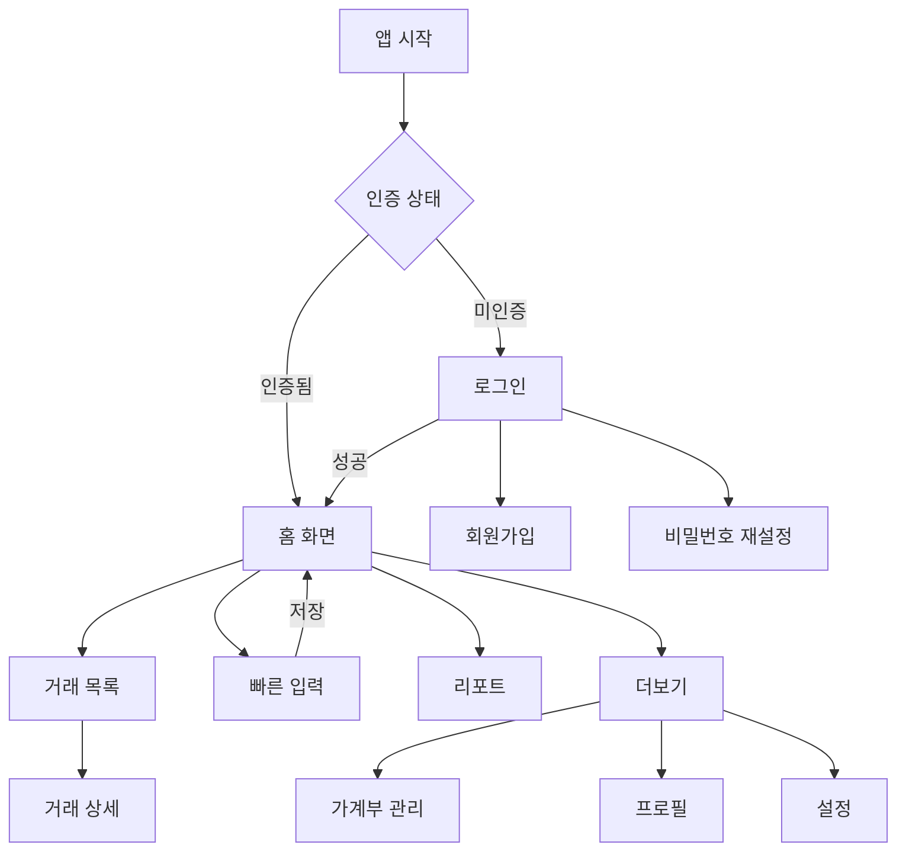

# Bugie 화면 설계 문서

## 📋 개요

Bugie는 웹과 네이티브 앱에서 동일한 경험을 제공하는 공유 가계부 서비스입니다. 
효율적인 개발과 유지보수를 위해 웹뷰와 네이티브를 적절히 혼합한 하이브리드 구조를 채택했습니다.

### 전체 화면 구조도

```
🏠 앱 진입
├── 🔐 인증 (네이티브)
│   ├── 로그인
│   ├── 회원가입
│   └── 비밀번호 재설정
│
└── 📊 메인 앱 (인증 후)
    ├── 🏠 홈 탭 (네이티브)
    │   └── 오늘의 요약
    │
    ├── 💰 거래 탭
    │   ├── 거래 목록 (웹뷰)
    │   ├── 거래 상세 (웹뷰)
    │   └── 거래 필터/검색 (웹뷰)
    │
    ├── ➕ 추가 탭 (네이티브)
    │   └── 빠른 입력 폼
    │
    ├── 📈 리포트 탭 (웹뷰)
    │   ├── 대시보드
    │   ├── 예산 현황
    │   └── 카테고리 분석
    │
    └── ⚙️ 더보기 탭
        ├── 프로필 (웹뷰)
        ├── 가계부 관리 (웹뷰)
        │   ├── 가계부 목록
        │   ├── 가계부 설정
        │   └── 멤버 관리
        └── 앱 설정 (네이티브)
```

### 구현 방식 구분

| 구현 방식 | 적용 화면 | 선택 이유 |
|----------|----------|----------|
| **네이티브** | • 로그인/회원가입<br>• 홈 화면<br>• 빠른 입력<br>• 푸시 알림 | • 빠른 반응성 필요<br>• 네이티브 기능 활용<br>• 오프라인 지원 |
| **웹뷰** | • 거래 목록/상세<br>• 리포트/대시보드<br>• 가계부 설정<br>• 프로필 관리 | • 복잡한 UI/UX<br>• 빈번한 업데이트<br>• 크로스 플랫폼 일관성 |

---

## 🔐 인증 화면

### [AUTH-01] 로그인 화면

#### 개요
- **목적**: 사용자 인증을 통한 앱 접근
- **구현 방식**: 네이티브
- **접근 경로**: 앱 최초 실행 또는 로그아웃 후

#### 주요 기능
- [ ] 이메일/비밀번호 로그인
- [ ] 소셜 로그인 (Google, Apple)
- [ ] 자동 로그인 (토큰 저장)
- [ ] 비밀번호 재설정 링크

#### UI 구성
| 구성 요소 | 설명 | 동작 |
|---------|------|------|
| 로고 | Bugie 브랜드 로고 | - |
| 이메일 입력 | 이메일 주소 입력 필드 | 키보드 표시 |
| 비밀번호 입력 | 비밀번호 입력 필드 | 보안 키보드 |
| 로그인 버튼 | 기본 로그인 실행 | 인증 API 호출 |
| 소셜 로그인 버튼 | Google/Apple 로그인 | OAuth 플로우 |
| 회원가입 링크 | 신규 가입 페이지 이동 | 화면 전환 |
| 비밀번호 찾기 | 비밀번호 재설정 | 화면 전환 |

#### 데이터 흐름
- **입력**: 이메일, 비밀번호
- **출력**: 인증 토큰, 사용자 정보
- **API**: `POST /auth/login`

#### 화면 전환
- **다음 화면**: 
  - 성공 → 홈 화면
  - 신규 가입 → 회원가입 화면
  - 비밀번호 재설정 → 재설정 화면

#### 예외 처리
- 잘못된 이메일/비밀번호: 에러 메시지 표시
- 네트워크 오류: 재시도 옵션 제공
- 계정 잠김: 관리자 문의 안내

---

### [AUTH-02] 회원가입 화면

#### 개요
- **목적**: 신규 사용자 계정 생성
- **구현 방식**: 네이티브
- **접근 경로**: 로그인 화면에서 "회원가입" 선택

#### 주요 기능
- [ ] 이메일 중복 확인
- [ ] 비밀번호 강도 검증
- [ ] 이용약관 동의
- [ ] 프로필 기본 정보 입력

#### UI 구성
| 구성 요소 | 설명 | 동작 |
|---------|------|------|
| 이메일 입력 | 고유 이메일 주소 | 실시간 중복 체크 |
| 비밀번호 입력 | 8자 이상, 특수문자 포함 | 강도 표시 |
| 비밀번호 확인 | 비밀번호 재입력 | 일치 여부 검증 |
| 닉네임 입력 | 표시될 이름 | 2-20자 제한 |
| 약관 동의 | 필수/선택 약관 | 체크박스 |
| 가입 버튼 | 계정 생성 실행 | API 호출 |

#### 데이터 흐름
- **입력**: 이메일, 비밀번호, 닉네임, 약관 동의
- **출력**: 사용자 계정 생성
- **API**: `POST /auth/signup`

#### 화면 전환
- **이전 화면**: 로그인 화면
- **다음 화면**: 
  - 성공 → 환영 화면 → 홈
  - 실패 → 현재 화면 유지

---

## 📊 메인 탭 화면

### [TAB-01] 홈 화면

#### 개요
- **목적**: 월간 재무 현황을 캘린더로 한눈에 보기
- **구현 방식**: 네이티브
- **접근 경로**: 하단 탭 바 "홈" 선택

#### 주요 기능
- [ ] 월간 캘린더 뷰 (일별 수입/지출 표시)
- [ ] 이번 달 전체 수입/지출/잔액 요약
- [ ] 오늘 날짜 하이라이트
- [ ] 좌우 스와이프로 월 변경
- [ ] 캘린더 날짜 탭하여 해당일 거래 보기
- [ ] 빠른 입력 버튼

#### UI 구성
```
┌─────────────────────────┐
│  안녕하세요, {닉네임}님   │
├─────────────────────────┤
│    ◀  2025년 1월  ▶    │
├─────────────────────────┤
│  일  월  화  수  목  금  토 │
│  29  30  31   1   2   3   4│
│            -5k  +100k -12k  │
│                             │
│   5   6   7   8   9  10  11│
│ -25k -8k     -15k  ○        │
│                   [오늘]    │
│  12  13  14  15  16  17  18│
│      -7k                    │
│                             │
│  19  20  21  22  23  24  25│
│ -30k                        │
│                             │
│  26  27  28  29  30  31   1│
│                             │
├─────────────────────────┤
│ 📊 이번 달 요약          │
│ 수입: ₩3,100,000 ↑      │
│ 지출: ₩  730,000 ↓      │
│ ─────────────────        │
│ 잔액: ₩2,370,000        │
├─────────────────────────┤
│      [+ 빠른 입력]       │
└─────────────────────────┘
```

#### 캘린더 표시 규칙
- **수입**: 파란색 (+100k 형식)
- **지출**: 빨간색 (-25k 형식)
- **오늘**: 원형 테두리 표시
- **다른 달**: 회색 처리
- **거래 없는 날**: 빈 칸

#### 데이터 흐름
- **입력**: 현재 년/월, 사용자 ID
- **출력**: 일별 수입/지출, 월간 합계
- **API**: `GET /summary/calendar?year=2025&month=1`

#### API 응답 예시
```json
{
  "dailySummary": {
    "2025-01-01": { "income": 0, "expense": 5000 },
    "2025-01-02": { "income": 100000, "expense": 0 },
    "2025-01-03": { "income": 0, "expense": 12000 },
    "2025-01-05": { "income": 0, "expense": 25000 }
  },
  "monthlyTotal": {
    "income": 3100000,
    "expense": 730000,
    "balance": 2370000
  }
}
```

#### 화면 전환
- **빠른 입력 버튼**: 거래 추가 화면
- **캘린더 날짜 탭**: 해당일 거래 목록 (웹뷰)
- **월 변경 화살표/스와이프**: 다른 월 데이터 로드

---

### [TAB-02] 거래 목록 화면 (웹뷰)

#### 개요
- **목적**: 전체 거래 내역 조회 및 관리
- **구현 방식**: 웹뷰
- **접근 경로**: 하단 탭 바 "거래" 선택

#### 주요 기능
- [ ] 월별/일별 거래 목록
- [ ] 거래 필터링 (카테고리, 금액)
- [ ] 거래 검색
- [ ] 무한 스크롤
- [ ] 거래 삭제/수정

#### UI 구성
| 구성 요소 | 설명 | 동작 |
|---------|------|------|
| 월 선택기 | 조회할 월 선택 | 데이터 새로고침 |
| 필터 버튼 | 카테고리/금액 필터 | 필터 모달 |
| 검색 바 | 거래 내용 검색 | 실시간 검색 |
| 거래 리스트 | 일자별 그룹핑 | 상세 페이지 이동 |
| 합계 표시 | 선택 기간 수입/지출 | - |

#### 데이터 흐름
- **입력**: 필터 조건, 검색어, 페이지
- **출력**: 거래 목록
- **API**: `GET /transactions`

#### 웹뷰 통신
```javascript
// Native → WebView
window.postMessage({
  type: 'FILTER_UPDATE',
  filters: { category, dateRange }
});

// WebView → Native
window.ReactNativeWebView.postMessage({
  type: 'NAVIGATE_TO_DETAIL',
  transactionId: 'xxx'
});
```

---

### [TAB-03] 빠른 입력 화면

#### 개요
- **목적**: 빠르고 간편한 거래 입력
- **구현 방식**: 네이티브
- **접근 경로**: 하단 탭 바 중앙 "+" 버튼

#### 주요 기능
- [ ] 금액 입력 (숫자 키패드)
- [ ] 수입/지출 토글
- [ ] 카테고리 빠른 선택
- [ ] 메모 입력 (선택)
- [ ] 자주 쓰는 항목

#### UI 구성
```
┌─────────────────────────┐
│     [지출] [수입]       │
├─────────────────────────┤
│                         │
│      ₩ 0                │
│   ┌───┬───┬───┐        │
│   │ 1 │ 2 │ 3 │        │
│   ├───┼───┼───┤        │
│   │ 4 │ 5 │ 6 │        │
│   ├───┼───┼───┤        │
│   │ 7 │ 8 │ 9 │        │
│   ├───┼───┼───┤        │
│   │ 00│ 0 │ ← │        │
│   └───┴───┴───┘        │
├─────────────────────────┤
│ 카테고리 선택          │
│ [식비][교통][쇼핑][+]  │
├─────────────────────────┤
│ 메모 (선택사항)        │
├─────────────────────────┤
│      [저장하기]         │
└─────────────────────────┘
```

#### 데이터 흐름
- **입력**: 금액, 유형, 카테고리, 메모
- **출력**: 새 거래 생성
- **API**: `POST /transactions`

#### 화면 전환
- **저장 성공**: 홈 화면으로 이동
- **카테고리 추가**: 카테고리 관리 (웹뷰)

---

### [TAB-04] 리포트 대시보드 (웹뷰)

#### 개요
- **목적**: 지출 패턴 분석 및 인사이트 제공
- **구현 방식**: 웹뷰
- **접근 경로**: 하단 탭 바 "리포트" 선택

#### 주요 기능
- [ ] 월별 수입/지출 트렌드
- [ ] 카테고리별 지출 비중
- [ ] 예산 대비 실제 지출
- [ ] 전월 대비 증감
- [ ] 지출 패턴 인사이트

#### UI 구성
| 구성 요소 | 설명 | 동작 |
|---------|------|------|
| 기간 선택 | 월/분기/년 단위 | 차트 업데이트 |
| 트렌드 차트 | 선 그래프 | 상세 수치 표시 |
| 카테고리 파이 | 원형 차트 | 카테고리 상세 |
| 예산 게이지 | 진행률 표시 | 예산 설정 이동 |
| 인사이트 카드 | AI 분석 결과 | 상세 보기 |

#### 데이터 흐름
- **입력**: 기간, 가계부 ID
- **출력**: 분석 데이터
- **API**: `GET /reports/dashboard`

---

## 🔧 가계부 관리 화면

### [LEDGER-01] 가계부 목록

#### 개요
- **목적**: 참여 중인 가계부 목록 관리
- **구현 방식**: 웹뷰
- **접근 경로**: 더보기 탭 → 가계부 관리

#### 주요 기능
- [ ] 참여 가계부 목록
- [ ] 가계부 생성
- [ ] 가계부 선택/전환
- [ ] 초대 수락/거절

#### UI 구성
```
┌─────────────────────────┐
│ 나의 가계부            │
├─────────────────────────┤
│ ✓ 우리집 가계부        │
│   소유자 · 멤버 2명    │
│                         │
│ ○ 부부 가계부          │
│   편집자 · 멤버 2명    │
│                         │
│ 💌 새로운 초대 (1)     │
├─────────────────────────┤
│ [+ 새 가계부 만들기]    │
└─────────────────────────┘
```

---

### [LEDGER-02] 가계부 설정

#### 개요
- **목적**: 가계부 정보 및 멤버 관리
- **구현 방식**: 웹뷰
- **접근 경로**: 가계부 목록 → 가계부 선택 → 설정

#### 주요 기능
- [ ] 가계부 이름/설명 수정
- [ ] 멤버 초대/삭제
- [ ] 권한 관리
- [ ] 가계부 삭제

#### UI 구성
| 구성 요소 | 설명 | 동작 |
|---------|------|------|
| 기본 정보 | 이름, 설명, 색상 | 인라인 편집 |
| 멤버 목록 | 참여자 및 권한 | 권한 변경/삭제 |
| 초대 버튼 | 새 멤버 초대 | 초대 모달 |
| 나가기 | 가계부 탈퇴 | 확인 다이얼로그 |
| 삭제 | 가계부 삭제 (소유자만) | 확인 다이얼로그 |

---

## 🎯 공통 컴포넌트

### 헤더
- **네이티브**: 뒤로가기, 제목, 액션 버튼
- **웹뷰**: 동일한 스타일로 웹에서 구현

### 하단 탭 바 (네이티브)
```
┌────┬────┬────┬────┬────┐
│ 홈 │거래│ ➕ │리포트│더보기│
└────┴────┴────┴────┴────┘
```

### 로딩 상태
- 스켈레톤 UI (목록)
- 스피너 (액션)
- 프로그레스 바 (업로드)

### 에러 처리
- 토스트 메시지 (일시적 오류)
- 에러 페이지 (치명적 오류)
- 재시도 버튼

---

## 📱 웹뷰 브릿지 API

### Native → WebView
```typescript
interface NativeToWebMessage {
  type: 'INIT' | 'AUTH_UPDATE' | 'THEME_CHANGE';
  payload: any;
}
```

### WebView → Native
```typescript
interface WebToNativeMessage {
  type: 'NAVIGATE' | 'SHARE' | 'ALERT';
  payload: any;
}
```

---

## 🔄 화면 전환 플로우



---

## 🔌 API 구현 방식

### Supabase API 활용 전략

화면 설계에서 언급된 API들은 Supabase를 통해 다음과 같이 구현됩니다:

#### 1. **자동 생성 REST API**
```typescript
// 예: GET /transactions
const { data } = await supabase
  .from('transactions')
  .select('*')
  .order('created_at', { ascending: false })

// 예: POST /auth/login
const { data, error } = await supabase.auth.signInWithPassword({
  email,
  password
})
```

#### 2. **복잡한 비즈니스 로직 - Edge Functions**
```typescript
// supabase/functions/summary-calendar/index.ts
// GET /summary/calendar 구현
serve(async (req) => {
  // 월간 데이터 집계 로직
  const dailySummary = aggregateByDay(transactions)
  const monthlyTotal = calculateMonthlyTotal(transactions)
  
  return new Response(JSON.stringify({ 
    dailySummary, 
    monthlyTotal 
  }))
})
```

#### 3. **실시간 동기화**
```typescript
// Realtime 구독
const channel = supabase
  .channel('transactions')
  .on('postgres_changes', 
    { event: '*', schema: 'public', table: 'transactions' },
    payload => {
      // 실시간 업데이트 처리
    }
  )
  .subscribe()
```

### API 엔드포인트 매핑

| 화면 설계 API | Supabase 구현 방식 |
|--------------|-------------------|
| `POST /auth/login` | `supabase.auth.signInWithPassword()` |
| `POST /auth/signup` | `supabase.auth.signUp()` |
| `GET /transactions` | `supabase.from('transactions').select()` |
| `POST /transactions` | `supabase.from('transactions').insert()` |
| `GET /summary/calendar` | Edge Function 또는 클라이언트 집계 |
| `GET /reports/dashboard` | Edge Function (복잡한 집계) |

---

## 📋 구현 우선순위

### Phase 1 (필수)
1. 인증 화면 (로그인/회원가입)
2. 홈 화면 (캘린더 뷰)
3. 빠른 입력
4. 거래 목록
5. 가계부 생성/선택

### Phase 2 (핵심)
1. 거래 상세/수정
2. 리포트 대시보드
3. 가계부 공유/초대
4. 예산 관리 (월별/주간)

### Phase 3 (개선)
1. 고급 필터/검색
2. 데이터 내보내기
3. 알림 설정
4. 테마 설정

---

이 문서는 개발 진행에 따라 지속적으로 업데이트됩니다.
마지막 업데이트: 2025-07-19