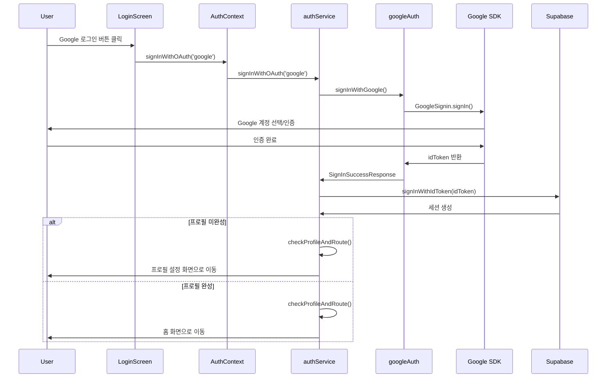

# 인증 시스템 설계 문서

## 1. 시스템 아키텍처

### 1.1 레이어드 아키텍처

```
┌─────────────────────────────────────────┐
│     Presentation Layer (UI)             │
│  - login.tsx                            │
│  - profile-setup.tsx                    │
├─────────────────────────────────────────┤
│     State Management Layer              │
│  - AuthContext (전역 인증 상태)           │
│  - useAuth Hook                         │
├─────────────────────────────────────────┤
│     Business Logic Layer                │
│  - authService (오케스트레이션)           │
│  - 인증 플로우 제어                       │
├─────────────────────────────────────────┤
│     Integration Layer                   │
│  - googleAuth (Google SDK)              │
│  - profileService (Supabase)            │
└─────────────────────────────────────────┘
                 │
                 ▼
┌─────────────────────────────────────────┐
│     External Services                   │
│  - Google Sign-In SDK                   │
│  - Supabase Auth & Database             │
└─────────────────────────────────────────┘
```

### 1.2 인증 플로우 (Google Sign-In SDK)



## 2. 기술 스택

### 2.1 프론트엔드

- **Framework**: Expo SDK 53 + React Native
- **라우팅**: Expo Router
- **상태관리**: React Context API
- **인증 SDK**: @react-native-google-signin/google-signin
- **타입**: TypeScript

### 2.2 백엔드

- **인증**: Supabase Auth (ID Token 방식)
- **데이터베이스**: PostgreSQL (Supabase)
- **실시간**: Supabase Realtime

### 2.3 아키텍처 패턴

- **서비스 레이어 패턴**: 비즈니스 로직 분리
- **도메인 중심 설계**: 기능별 모듈화
- **레이어드 아키텍처**: 관심사 분리

## 3. 서비스 레이어 아키텍처

### 3.1 도메인 중심 구조

```
services/
└── auth/                    # 인증 도메인
    ├── authService.ts       # 비즈니스 로직 오케스트레이션
    ├── googleAuth.ts        # Google SDK 통합
    ├── profileService.ts    # 프로필 데이터 액세스
    └── index.ts            # 통합 export
```

### 3.2 서비스별 책임

#### authService.ts

- OAuth 프로바이더 라우팅
- 인증 플로우 관리
- 프로필 기반 화면 라우팅
- 비즈니스 로직 조율

#### googleAuth.ts

- Google Sign-In SDK 래핑
- ID Token 획득
- 에러 코드 표준화
- Play Services 확인

#### profileService.ts

- Supabase profiles 테이블 CRUD
- 프로필 완성도 검증
- 데이터베이스 에러 처리

## 4. 데이터 모델

### 4.1 TypeScript Types

```typescript
// @repo/types/src/auth.ts

// Supabase 타입 확장
export interface User extends SupabaseUser {}
export interface Session extends SupabaseSession {}

export interface AuthProfile {
  id: string;
  email: string | null;
  full_name: string | null;
  avatar_url?: string | null;
  currency: string | null;
  timezone: string | null;
  created_at: string | null;
  updated_at: string | null;
  deleted_at?: string | null;
}

export interface AuthState {
  user: User | null;
  profile: AuthProfile | null;
  session: Session | null;
  loading: boolean;
  needsProfile: boolean;
}

export type OAuthProvider = 'google' | 'apple' | 'kakao';
```

### 4.2 Database Schema

```sql
-- public.profiles 테이블
CREATE TABLE public.profiles (
  id UUID REFERENCES auth.users(id) PRIMARY KEY,
  email TEXT,
  full_name TEXT,
  avatar_url TEXT,
  currency TEXT DEFAULT 'KRW',
  timezone TEXT DEFAULT 'Asia/Seoul',
  created_at TIMESTAMPTZ DEFAULT NOW(),
  updated_at TIMESTAMPTZ DEFAULT NOW(),
  deleted_at TIMESTAMPTZ
);

-- RLS 정책
ALTER TABLE public.profiles ENABLE ROW LEVEL SECURITY;

-- 사용자 생성 트리거
CREATE TRIGGER on_auth_user_created
  AFTER INSERT ON auth.users
  FOR EACH ROW EXECUTE FUNCTION public.handle_new_user();
```

## 5. 컴포넌트 구조

### 5.1 디렉토리 구조 (현재 구현)

```
apps/native/
├── app/
│   ├── (auth)/
│   │   ├── login.tsx           # 로그인 화면 (UI)
│   │   └── profile-setup.tsx   # 프로필 설정 (미구현)
│   └── (tabs)/
│       └── index.tsx           # 홈 화면
├── components/
│   └── auth/
│       └── SocialLoginButton.tsx  # 소셜 로그인 버튼
├── contexts/
│   └── AuthContext.tsx        # 전역 인증 상태 관리
├── services/
│   └── auth/                  # 인증 서비스 레이어
│       ├── authService.ts
│       ├── googleAuth.ts
│       ├── profileService.ts
│       └── index.ts
├── hooks/
│   └── useAuth.ts            # AuthContext 훅
└── utils/
    └── supabase.ts           # Supabase 클라이언트
```

### 5.2 핵심 컴포넌트

#### AuthContext

- 전역 인증 상태 관리
- Supabase 세션 동기화
- OAuth 로그인 메서드 제공
- 프로필 업데이트 기능

#### SocialLoginButton

- OAuth 프로바이더별 버튼 UI
- 로딩 및 비활성화 상태 처리
- 애니메이션 효과

## 6. 에러 처리 전략

### 6.1 에러 타입 정의

```typescript
// Google Sign-In 에러
interface GoogleAuthError {
  code: 'CANCELLED' | 'IN_PROGRESS' | 'PLAY_SERVICES_NOT_AVAILABLE' | 'UNKNOWN';
  message: string;
}

// 인증 결과
interface AuthResult {
  success: boolean;
  error?: string;
  needsProfile?: boolean;
}
```

### 6.2 에러 처리 계층

1. **Integration Layer**: SDK별 에러를 표준화
2. **Business Layer**: 비즈니스 로직 에러 처리
3. **UI Layer**: 사용자 친화적 메시지 표시

## 7. 보안 고려사항

### 7.1 토큰 보안

- Google ID Token을 통한 안전한 인증
- Supabase 세션 자동 관리
- SecureStore 사용 예정 (향후 구현)

### 7.2 데이터 보안

- RLS(Row Level Security) 정책 적용
- 프로필 접근 권한 제어
- API 키 환경변수 분리

## 9. 향후 구현 계획

### 9.1 Phase 1 완료 (현재)

- ✅ Google Sign-In 통합
- ✅ 서비스 레이어 아키텍처
- ✅ 기본 인증 플로우

### 9.2 Phase 2 (예정)

- [ ] Apple/Kakao 로그인
- [ ] 프로필 설정 화면
- [ ] SecureStore 토큰 저장
- [ ] 자동 로그인

### 9.3 Phase 3 (예정)

- [ ] 웹뷰 통합
- [ ] 세션 동기화
- [ ] 오프라인 지원
