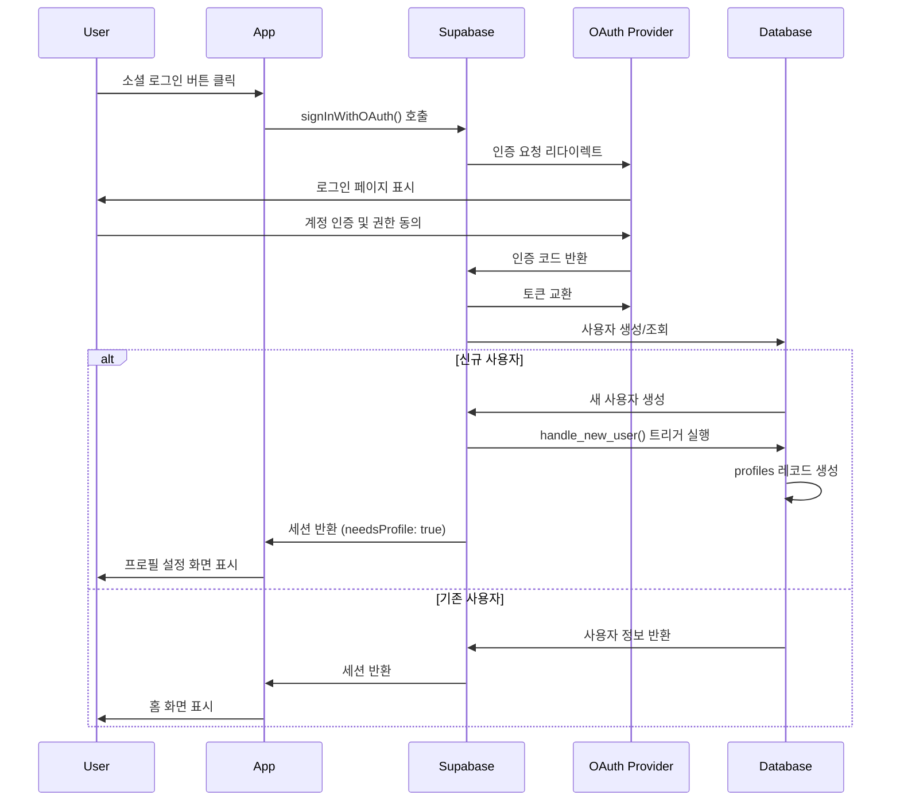

# 인증 시스템 설계 문서

## 1. 시스템 아키텍처

### 1.1 전체 구조

```
┌─────────────────────────────────────────┐
│         Native App (Expo)               │
├─────────────────────────────────────────┤
│  - Login Screen (네이티브)              │
│  - Profile Setup Screen (네이티브)      │
│  - AuthContext (인증 상태 관리)         │
│  - SecureStore (토큰 저장)              │
└────────────────┬───────────────────────┘
                 │ 세션 전달
                 ▼
┌─────────────────────────────────────────┐
│      WebView (거래, 리포트 등)          │
├─────────────────────────────────────────┤
│  - 네이티브에서 받은 세션 사용         │
│  - Supabase 클라이언트 자동 초기화     │
└─────────────────────────────────────────┘
                 │
                 ▼
┌─────────────────────────────────────────┐
│         Supabase Backend                │
├─────────────────────────────────────────┤
│  - OAuth Providers (Google/Apple/Kakao) │
│  - JWT Token Management                 │
│  - PostgreSQL (auth.users, profiles)   │
└─────────────────────────────────────────┘
```

### 1.2 인증 플로우



## 2. 기술 스택

### 2.1 네이티브 앱
- Framework: Expo SDK 53
- 라우팅: Expo Router
- 상태관리: React Context API
- 스타일링: React Native StyleSheet
- 보안 저장소: Expo SecureStore
- 타입: TypeScript

### 2.2 웹뷰
- Framework: Next.js 15
- 세션 관리: 네이티브에서 주입받은 토큰 사용
- 스타일링: Tailwind CSS

### 2.3 백엔드
- 인증: Supabase Auth
- 데이터베이스: PostgreSQL
- OAuth Providers: Google, Apple, Kakao

## 3. 데이터 모델

### 3.1 Database Schema

```sql
-- Supabase가 관리하는 auth.users 테이블 확장
-- public.profiles 테이블
CREATE TABLE public.profiles (
  id UUID REFERENCES auth.users(id) ON DELETE CASCADE PRIMARY KEY,
  email TEXT,
  full_name TEXT,
  avatar_url TEXT,
  currency TEXT DEFAULT 'KRW',
  timezone TEXT DEFAULT 'Asia/Seoul',
  created_at TIMESTAMPTZ DEFAULT NOW(),
  updated_at TIMESTAMPTZ DEFAULT NOW(),
  deleted_at TIMESTAMPTZ -- Soft delete
);

-- RLS 정책
ALTER TABLE public.profiles ENABLE ROW LEVEL SECURITY;

CREATE POLICY "Users can view own profile" ON public.profiles
  FOR SELECT USING (auth.uid() = id);

CREATE POLICY "Users can update own profile" ON public.profiles
  FOR UPDATE USING (auth.uid() = id);

-- 트리거: 새 사용자 생성 시 프로필 자동 생성
CREATE OR REPLACE FUNCTION public.handle_new_user()
RETURNS TRIGGER AS $$
BEGIN
  INSERT INTO public.profiles (id, email, full_name)
  VALUES (
    NEW.id,
    NEW.email,
    COALESCE(NEW.raw_user_meta_data->>'full_name', NEW.email)
  );
  RETURN NEW;
END;
$$ LANGUAGE plpgsql SECURITY DEFINER;

CREATE TRIGGER on_auth_user_created
  AFTER INSERT ON auth.users
  FOR EACH ROW EXECUTE PROCEDURE public.handle_new_user();
```

### 3.2 TypeScript Types

```typescript
// @repo/types/src/auth.ts

export interface User {
  id: string;
  email: string;
  created_at: string;
}

export interface Profile {
  id: string;
  email: string;
  full_name: string;
  avatar_url?: string;
  currency: string;
  timezone: string;
  created_at: string;
  updated_at: string;
}

export interface AuthState {
  user: User | null;
  profile: Profile | null;
  session: Session | null;
  loading: boolean;
  needsProfile: boolean;
}

export interface Session {
  access_token: string;
  refresh_token: string;
  expires_at: number;
  user: User;
}

export type OAuthProvider = 'google' | 'apple' | 'kakao';
```

## 4. 컴포넌트 설계

### 4.1 디렉토리 구조

```
packages/types/
└── src/
    ├── index.ts
    └── auth.ts

apps/native/
├── app/
│   ├── (auth)/
│   │   ├── login.tsx
│   │   ├── profile-setup.tsx
│   │   └── _layout.tsx
│   ├── (tabs)/
│   │   ├── _layout.tsx
│   │   └── webview.tsx
│   └── _layout.tsx
├── components/
│   ├── auth/
│   │   ├── SocialLoginButton.tsx
│   │   ├── ProfileForm.tsx
│   │   └── AuthGuard.tsx
│   ├── webview/
│   │   └── AuthenticatedWebView.tsx
│   └── ui/
├── contexts/
│   └── AuthContext.tsx
├── hooks/
│   └── useAuth.ts
└── utils/
    ├── supabase.ts
    └── webviewBridge.ts

apps/web/
├── lib/
│   └── supabase/
│       └── webview-client.ts  # 웹뷰 전용 클라이언트
└── utils/
    └── auth-helpers.ts        # 세션 수신 헬퍼
```

### 4.2 핵심 컴포넌트

#### 4.2.1 AuthContext (네이티브)
```typescript
interface AuthContextValue {
  user: User | null;
  profile: Profile | null;
  session: Session | null;
  loading: boolean;
  needsProfile: boolean;
  signInWithOAuth: (provider: OAuthProvider) => Promise<void>;
  signOut: () => Promise<void>;
  updateProfile: (data: Partial<Profile>) => Promise<void>;
}
```

#### 4.2.2 AuthenticatedWebView
```typescript
interface Props {
  url: string;
  onMessage?: (event: WebViewMessageEvent) => void;
}
```
- 세션 자동 주입
- 토큰 갱신 처리
- 웹뷰-네이티브 통신

#### 4.2.3 공통 컴포넌트
- **SocialLoginButton**: OAuth 버튼
- **ProfileForm**: 프로필 설정 폼
- **AuthGuard**: 인증 보호 래퍼

## 5. API 설계

### 5.1 네이티브 앱 설정

```typescript
// 네이티브용 Supabase 클라이언트
import { createClient } from '@supabase/supabase-js';
import * as SecureStore from 'expo-secure-store';

const ExpoSecureStoreAdapter = {
  getItem: (key: string) => SecureStore.getItemAsync(key),
  setItem: (key: string, value: string) => SecureStore.setItemAsync(key, value),
  removeItem: (key: string) => SecureStore.deleteItemAsync(key),
};

export const supabase = createClient(
  process.env.EXPO_PUBLIC_SUPABASE_URL!,
  process.env.EXPO_PUBLIC_SUPABASE_ANON_KEY!,
  {
    auth: {
      storage: ExpoSecureStoreAdapter,
      autoRefreshToken: true,
      persistSession: true,
      detectSessionInUrl: false
    }
  }
);
```

### 5.2 웹뷰 브릿지

```typescript
// 네이티브: 웹뷰에 세션 주입
export const AuthenticatedWebView = ({ url }: { url: string }) => {
  const { session } = useAuth();
  
  const injectedJavaScript = `
    window.supabaseSession = ${JSON.stringify(session)};
    window.supabaseUrl = '${process.env.EXPO_PUBLIC_SUPABASE_URL}';
    window.supabaseAnonKey = '${process.env.EXPO_PUBLIC_SUPABASE_ANON_KEY}';
    true;
  `;
  
  return (
    <WebView
      source={{ uri: url }}
      injectedJavaScriptBeforeContentLoaded={injectedJavaScript}
      onMessage={handleMessage}
    />
  );
};

// 웹: 네이티브에서 받은 세션 사용
export const createWebViewClient = () => {
  if (typeof window !== 'undefined' && window.supabaseSession) {
    const client = createClient(
      window.supabaseUrl,
      window.supabaseAnonKey
    );
    client.auth.setSession(window.supabaseSession);
    return client;
  }
  // 개발 환경 폴백
  return createClient(
    process.env.NEXT_PUBLIC_SUPABASE_URL!,
    process.env.NEXT_PUBLIC_SUPABASE_ANON_KEY!
  );
};
```

### 5.3 세션 동기화

```typescript
// 네이티브: 세션 변경 감지 및 웹뷰 업데이트
const WebViewScreen = () => {
  const { session } = useAuth();
  const webViewRef = useRef<WebView>(null);
  
  useEffect(() => {
    if (webViewRef.current && session) {
      webViewRef.current.postMessage(JSON.stringify({
        type: 'SESSION_UPDATE',
        session: session
      }));
    }
  }, [session]);
  
  return <AuthenticatedWebView ref={webViewRef} url="..." />;
};

// 웹: 세션 업데이트 수신
window.addEventListener('message', (event) => {
  if (event.data.type === 'SESSION_UPDATE') {
    const supabase = createWebViewClient();
    supabase.auth.setSession(event.data.session);
  }
});
```

## 6. 보안 고려사항

### 6.1 토큰 보안
- 네이티브: Expo SecureStore (암호화 저장)
- 웹뷰: 토큰은 메모리에만 존재
- HTTPS로만 토큰 전송

### 6.2 웹뷰 보안
- 신뢰할 수 있는 URL만 허용
- 민감한 API 호출은 네이티브에서 처리
- 웹뷰 내 localStorage 사용 금지

## 7. 개발 및 테스트

### 7.1 개발 환경
- Supabase 로컬 개발 환경 사용
- 웹 개발 시 목 OAuth 사용 가능
- Expo Go에서는 OAuth 테스트 불가 (Dev Client 필요)

### 7.2 테스트 시나리오
1. 신규 사용자 소셜 로그인 → 프로필 설정
2. 기존 사용자 로그인 → 홈 화면
3. 웹뷰 세션 주입 확인
4. 토큰 갱신 테스트
5. 로그아웃 후 웹뷰 세션 제거

## 8. 배포 고려사항

### 8.1 환경 변수
```env
# 네이티브 앱 (.env)
EXPO_PUBLIC_SUPABASE_URL=
EXPO_PUBLIC_SUPABASE_ANON_KEY=

# 웹 (개발용)
NEXT_PUBLIC_SUPABASE_URL=
NEXT_PUBLIC_SUPABASE_ANON_KEY=
```

### 8.2 OAuth 설정
- 네이티브 콜백: `bugie://auth/callback`
- Supabase 리다이렉트 URL 등록 필요
- 각 OAuth Provider별 앱 등록

### 8.3 웹뷰 보안
- 신뢰할 수 있는 도메인만 허용
- 세션 정보는 HTTPS로만 전송
- 웹뷰 내 저장소 사용 금지